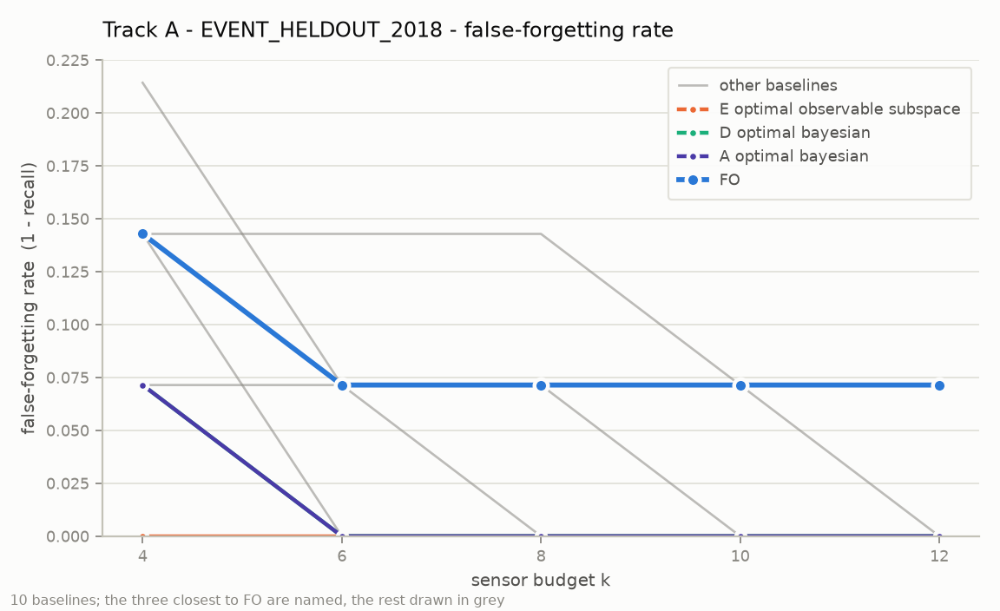
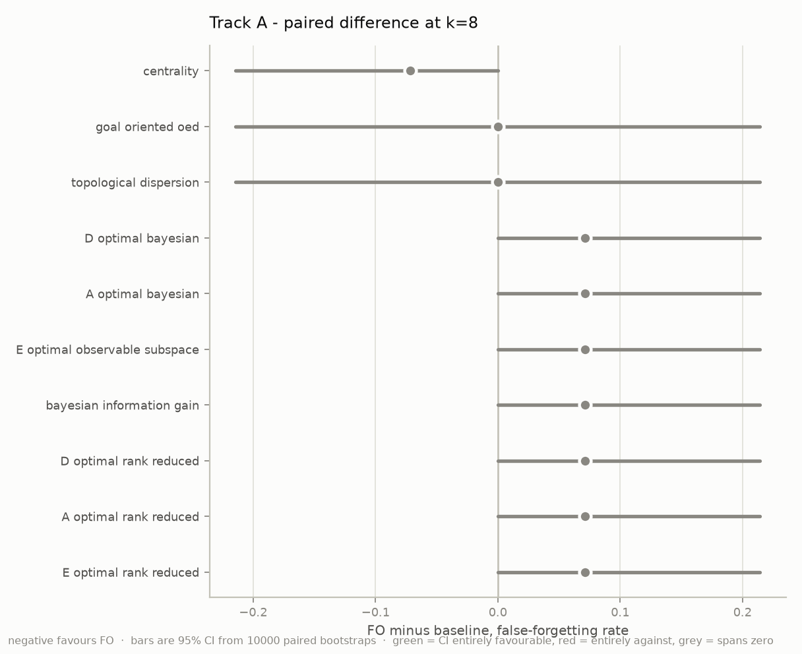
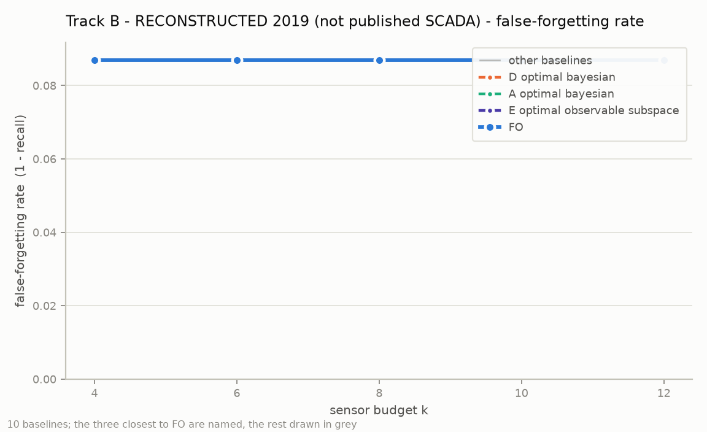
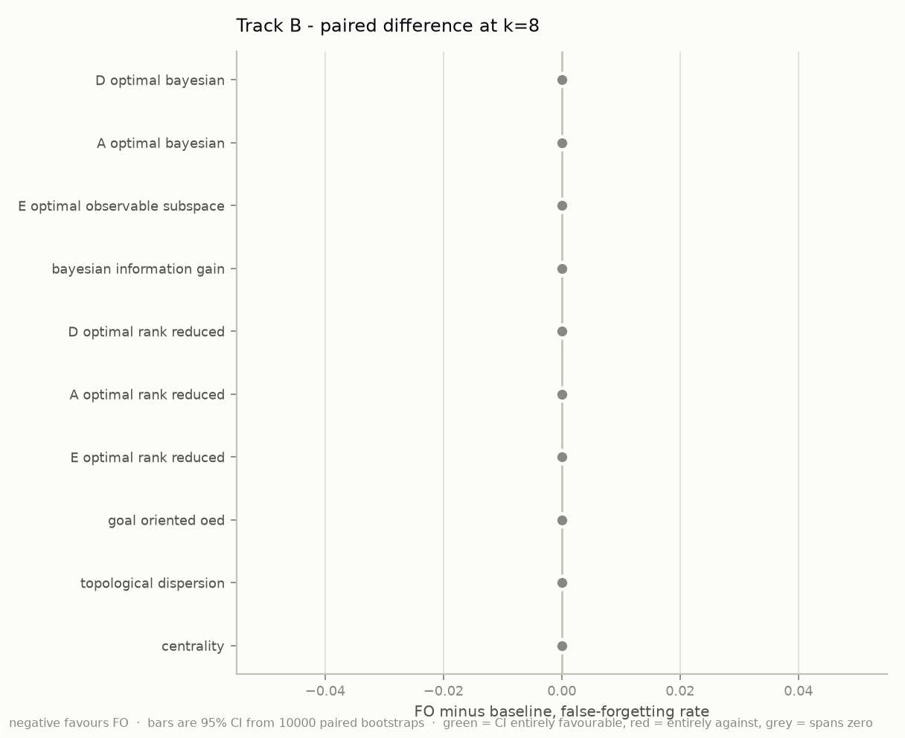
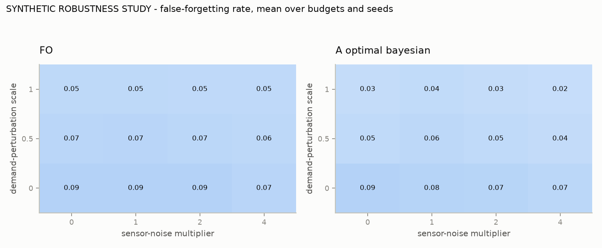

# FO / Frontière d'Oubli — external validation attempt on BattLeDIM / L-Town

## Verdicts

| scope | verdict |
|---|---|
| `EVENT_HELDOUT_2018_VERDICT` | **NOT_SUPPORTED** |
| `RECONSTRUCTED_2019_VERDICT` | **NOT_SUPPORTED** |
| `ROBUSTNESS_VERDICT` | **NOT_SUPPORTED** |
| **global** | **NOT_SUPPORTED** |

Track A NOT_SUPPORTED, Track B NOT_SUPPORTED, Track C NOT_SUPPORTED. VALIDATED_EXTERNALLY is not available from this repository: it requires the published BattLeDIM SCADA or another comparable real external dataset, and the published SCADA could not be downloaded (finding F1).

> `VALIDATED_EXTERNALLY` is **not** claimed and cannot be produced by this
> repository. The published BattLeDIM SCADA could not be downloaded, so FO has
> not been run on the real external dataset. The permitted global vocabulary is
> `STRONG_INTERNAL_BENCHMARK_SUPPORT` / `PROMISING` / `INCONCLUSIVE` /
> `NOT_SUPPORTED`, enforced in code by an assertion against `GLOBAL_VERDICTS`.

---

## 1. Data provenance

- **Source used**: https://github.com/KIOS-Research/BattLeDIM @ `ea81f544debb21587e09c32801ce605f8305720a` — This is the organisers' own repository (KIOS Research and Innovation Centre of Excellence, University of Cyprus), i.e. the official upstream, not a third-party mirror.
- **Licence**: EUPL v1.1 (see data/raw/battledim_official/LICENSE.md)
- **Citation**: S. G. Vrachimis, D. G. Eliades, R. Taormina, Z. Kapelan, A. Ostfeld, S. Liu, M. Kyriakou, P. Pavlou, M. Qiu, M. M. Polycarpou, 'Battle of the Leakage Detection and Isolation Methods', Journal of Water Resources Planning and Management, doi:10.1061/(ASCE)WR.1943-5452.0001601

Download attempts, in the order the protocol prescribes:

| # | target | result | exact error |
|---|---|---|---|
| 1 | Official BattLeDIM website - https://battledim.ucy.ac.cy/ (Data page ?page_id=33) | FAILED | `curl: (56) CONNECT tunnel failed, response 403  (HTTP code 000)` |
| 1 | Official BattLeDIM rules PDF - https://www.battledim.ucy.ac.cy/wp-content/uploads/2020/02/BattLeDIM_Problem_De | FAILED | `{"error_type":"EGRESS_BLOCKED","domain":"www.battledim.ucy.ac.cy","message":"Access to www.battledim.ucy.ac.cy is blocked by the network egress proxy."}` |
| 2 | Zenodo record 4017659 - https://zenodo.org/records/4017659 (canonical dataset DOI 10.5281/zenodo.4017659) | FAILED | `curl: (56) CONNECT tunnel failed, response 403  (HTTP code 000)` |
| 3 | Public GitHub mirror - https://github.com/KIOS-Research/BattLeDIM | PARTIAL SUCCESS | `https://github.com/KIOS-Research/BattLeDIM -> HTTP 403; https://api.github.com/repos/KIOS-Research/BattLeDIM -> HTTP 403; https://codeload.github.com/KIOS-Research/BattLeDIM/tar.gz/refs/heads/master -> HTTP 403` |
| 4 | File-by-file download of Git-LFS payloads | SUCCESS | `The three *.inp files are Git-LFS tracked; the anonymous git lane serves only 131-byte pointer stubs. Real payloads retrieved individually from media.githubusercontent.com (HTTP 200): L-TOWN_v2_Real.inp 177151858 B, L-TOWN_v2_Model.inp 409786 B, L-TOWN.inp 412` |
| 5 | Other mirrors probed for the published SCADA CSVs | FAILED - no mirror of the published CSV/XLSX SCADA files found | `huggingface.co, gitlab.com, osf.io, figshare.com, data.4tu.nl, kaggle.com, gitee.com, archive.softwareheritage.org, drive.google.com, ucy.ac.cy -> all HTTP 000 (CONNECT 403)` |

**The published SCADA CSVs were never obtained.** Everything downstream runs on
data regenerated with the official generator, the official network model and the
official leak schedule — a pipeline that contains no random draw.

### File digests

| file | bytes | SHA256 |
|---|---|---|
| `data/raw/PROVENANCE.json` | 7916 | `618d67d28d3dbf2be242dcb096304d92156669ce9e9b5da1864cece79522fd76` |
| `data/raw/battledim_official/L-TOWN.inp` | 412164 | `6cc586edcb18d7aa094f653bf2e45608950559e7c1f151c96c80a67f635283e2` |
| `data/raw/battledim_official/L-TOWN_v2_Model.inp` | 409786 | `1b9ba161e3aebe02a916876d60c2126ee76f75e9f0d23c9ec4dfffd59cc0c366` |
| `data/raw/battledim_official/L-TOWN_v2_Real.inp` | 177151858 | `0570538d93246d452e740316ffec66dabc17526b18c47384a083e76061551023` |
| `data/raw/battledim_official/LICENSE.md` | 13793 | `49f83599832256fdceb27c2f5e63ce8bc4ffc599e98038bbb23bda41f1cfb68c` |
| `data/raw/battledim_official/README.txt` | 1063 | `bfbb042f2539a141ca81890105be852b6ccffb459d1495f07ea7f2c09b369101` |
| `data/raw/battledim_official/SOURCE_COMMIT.txt` | 125 | `a924baf4e330b2b5e6a4647a8f661bc9c336de26c71d627c9503196d45247e85` |
| `data/raw/battledim_official/Scoring_Algorithm.m` | 5749 | `ab59f84cb633c07c3fc4d634d79085fa077db0bd17641d1ff563a2a698c9a584` |
| `data/raw/battledim_official/dataset_configuration.yalm` | 3756 | `d74c6f2693ef81152d4aa4b4bca1b651f173edf50f8d5f702226d55a0f358790` |
| `data/raw/battledim_official/dataset_configuration_evaluation.yalm` | 2940 | `8780dda455f3c536e5283b6a2aa91deaad14430e4942976f05ef386e93fe8436` |
| `data/raw/battledim_official/dataset_configuration_historical.yalm` | 2210 | `19ac0fd99e7754d2e1df8af24dcdf21169c054c21fee1aaf64870ee8ec57ec96` |
| `data/raw/battledim_official/dataset_generator.py` | 12796 | `dc4b8b08e6e37f34841473f5c2d7fffb7e189f4c2edbeed8cfface4701133f0f` |
| `data/raw/battledim_official/leakages_info.yalm` | 1880 | `e5086e2f9e39624f7178ba7fc017de6a3d99dd336ccc660f9dd95a2295c02895` |

Full manifest: `DATA_MANIFEST.json` (48 files, 213718380 bytes) with rows, columns, column names, temporal
coverage and missing-value counts per file.

## 2. Critical findings about the artefacts

**F1 (blocking-for-verbatim-reproduction)** — The published SCADA measurement files (2018_SCADA_*.csv / .xlsx, 2019_SCADA_*.csv / .xlsx) could not be downloaded from any reachable host. Only the generator, the network models and the leak ground truth are recoverable.

**F2 (material-for-external-validity)** — L-TOWN_v2_Real.inp contains 104 demand patterns of length 105120 at a 300 s pattern timestep, i.e. exactly 365.0 days. dataset_configuration.yalm requests 2018-01-01 -> 2019-12-31 (210240 steps). EPANET/WNTR pattern indexing wraps modulo pattern length, so a two-year run reproduces the 2018 demand series verbatim in 2019. Verified empirically: pattern.at(t) == pattern.at(t + 105120*300) for all sampled patterns and offsets. Consequence: any dataset regenerated from this published artefact has identical demands in both years, which is very likely NOT true of the official published SCADA and which removes demand uncertainty from the 2019 test set.

**F3 (material-for-external-validity)** — The published dataset_generator.py applies NO measurement noise. It defines self.unc_range = np.arange(0, 0.25, 0.05) but never uses it, indicating the released generator is not the exact version that produced the published SCADA. The official noise specification lives in the rules PDF, which is on a blocked host.

**F4 (protocol-exposure)** — The 2019 leak ground truth (link IDs, start/end/peak times, diameters) is stored in the SAME files as the 2018 configuration (dataset_configuration.yalm) and in leakages_info.yalm. It was therefore visible during the mandatory data-inventory step, before FROZEN_PROTOCOL.json existed. Mitigation is procedural and code-level, not informational: no threshold, hyperparameter, sensor subset or FO criterion is derived from any 2019 quantity, and the freezing code reads only 2018-derived artefacts. This exposure is recorded rather than concealed.

## 2b. Fidelity of the regeneration, and whether F2 applies to the real benchmark

The organisers ship 23 official `Leak_p*.xlsx` series with their scoring code
— their own generator run, 105120 five-minute samples each. Comparing our
regenerated 2019 leak flows against them:

| statistic | value |
|---|---|
| series compared | 23 |
| worst relative disagreement of any series **mean** | 4.05e-05 |
| mean fraction of samples within the generator's 0.01 rounding | 0.9491 |
| worst max absolute difference | 0.240 m3/h |
| verdict | **REGENERATION_MATCHES_OFFICIAL_TO_SOLVER_PRECISION** |

F2 CONFIRMED FOR THE REAL BENCHMARK: reproducing the official 2019 leak flows requires the nodal pressures, hence the demands, to match the official run, and our run uses the published model's repeating 365-day patterns. Worst relative disagreement of any series mean is 4.05e-05, which different demand data could not produce. The annual demand repetition is therefore a property of the BattLeDIM benchmark itself, not an artefact of this reconstruction. (means agree to better than 1e-3 relative; the residual sample scatter is consistent with a different WNTR solver version, not with different input data)

This raises what Track B is worth — the leak physics of the reconstruction
matches official output to solver precision — but it does **not** make Track B
a validation on the published SCADA. The published pressure and flow
measurements remain unreachable, and with them whatever measurement noise the
organisers added (F3).

## 2c. Correction applied before the test year was opened

**C-BIAS**

- *Problem*: The 2018 training year is not leak-free (a leak runs from 8 January onwards), so the fitted nominal model is biased. On the leak-free control year the standardised residual sits at +0.37 sigma on median and up to +2.45 sigma on 6 of 33 sensors. A CUSUM with slack k accumulates without bound whenever |mean| > k, so with k = 0.5 the bias alone drove the chart and the calibrated threshold exploded to h = 4094.
- *Correction*: Subtract a per-sensor bias estimated as the median standardised residual on the leak-free 2018 control year, which contains no leaks and therefore isolates pure model bias.
- *Chosen using*: 2018 artefacts only; 2019 had not been simulated yet

The freeze was therefore reissued once. The superseded protocol is committed
as `FROZEN_PROTOCOL_superseded_C-BIAS.json` so the change is auditable. The
2019 regeneration was still running when the corrected freeze completed, and
the runtime guard was armed throughout and did not fire.

## 3. Methodology

### 3.1 The FO criterion

For a latent scenario `z`, a sensor network `S` and a rich reference `R`,
visibility in units of sensor noise is

```
d_S(z) = max_t max_{j in S} |Delta p[z, j, t]| / sigma_j
```

with `Delta p[z, j, t]` the pressure drop a reference-size leak in scenario `z`
induces at sensor `j` at operating snapshot `t`. With `d_ref = d_R`,

```
E_kappa      = { z : d_ref(z) >= kappa }
B_kappa_eta(S) = P[ d_S(z) <= eta | d_ref(z) >= kappa ]
```

`B` is the false-forgetting rate — the reconstructibility blind spot. Selection
minimises `B`, then breaks ties on the 5th percentile of visibility over
`E_kappa`, then the 10th percentile, then the mean, exactly as pre-registered.

Frozen from 2018: `kappa = 3.0`, `eta = 3.0`, `tau = 1.0`, CUSUM slack `k = 0.5`, alarm threshold `h = 359.1545`.

### 3.2 Leak physics

The BattLeDIM orifice leak `q = Cd A sqrt(2 g p)` with `Cd = 0.75` is reproduced
as an EPANET emitter with `C = Cd sqrt(2 g) A`. That equivalence is **tested**,
not asserted, against wntr's own `add_leak`: maximum relative deviation
**4.6e-07** over 72 steps. The library build aborts if it exceeds 2%.

### 3.3 Identical detector

Every method — FO and all baselines — uses the same pipeline: ridge nominal
model on exogenous inputs only (3 inlet flows, tank level, 3 daily harmonics,
day-of-week), robust MAD residual scaling, per-sensor two-sided CUSUM with
re-baselining, and cosine-similarity localisation against the leak-signature
library. Only the sensor subset differs.

### 3.4 Baselines

`theta` has 782 components against a budget of at most 12, so the Fisher
information is singular and **classical D-, A- and E-optimality are undefined**
here — they would rank every subset identically. Two well-posed adaptations are
implemented and named for what they are:

- **Bayesian-regularised** (`*_bayesian`) — exact Bayesian D/A optimality under a
  `N(0, tau^2 I)` prior, evaluated through the determinant identity and Woodbury
  so the cost is `k x k` rather than `782 x 782`. No approximation.
- **Rank-r reduced** (`*_rank_reduced`) — classical D/A/E optimality on the
  leading `r = 4` right singular vectors of `H`.
- **`E_optimal_observable_subspace`** — deliberately *not* called Bayesian
  E-optimal. Literal Bayesian E-optimality is **degenerate** here:
  `lambda_min(H_S^T H_S/sigma^2 + I/tau^2) = 1/tau^2` for every subset. This is
  an anomaly of the setting, recorded rather than hidden.
- **`bayesian_information_gain`** — mutual information `I(y_S; theta)`.
- **`goal_oriented_oed`** — maximises the minimum angular separation between
  scenario signatures, targeting localisation rather than magnitude variance.
- **`topological_dispersion`** — greedy max-min pipe-length dispersion.
- **`centrality`** — top-k weighted betweenness.
- **`random`** — 100 replications per budget.

Optimiser is identical across methods at each budget: exhaustive where
affordable (`k=4`, C(33,4)=40920), greedy forward otherwise, with both run at
`k=4` so the greedy gap is measured rather than assumed.

## 4. Proof of freeze before 2019

- `FROZEN_PROTOCOL.json` SHA256: `09b5530432925a17f53c9c4e8dd4f7d6c41652bab3578faf1e81b761b33dfde2`
- frozen at: `2026-08-13T14:36:08.163174+00:00`
- The freeze installs a runtime guard patching `builtins.open` and `numpy.load`
  so that **any** read of a 2019 or evaluation artefact raises. The guard is
  armed for the whole freeze, so a contaminated protocol aborts rather than
  being emitted silently.
- `run_full_validation.py` stage 7 refuses to open 2019 unless the frozen file
  and its digest already exist.

**Honest caveat (F4).** The organisers ship the 2019 ground truth inside the
same file as the 2018 configuration, so it was visible during the mandatory
data inventory, before the freeze existed. The guard addresses the code path,
not that exposure. No threshold, hyper-parameter, sensor subset or FO quantity
is derived from any 2019 value, but the exposure is real and is recorded here
rather than concealed.

## 5. Track A — `EVENT_HELDOUT_2018`

Leave-one-leak-event-out over the 14 events of 2018. Per fold the
nominal model, sigma, the alarm threshold and every method's sensor subset are
re-derived without the held-out event.

### Budget k = 4

| method | recall | false_forgetting_rate | n_events_detected | delay_mean_h | localisation_mean_m | false_positives_mean | battledim_score_eur_mean |
|---|---|---|---|---|---|---|---|
| E_optimal_observable_subspace | 1.000 | 0.000 | 14 | 236.101 | 2033.232 | 12.929 | 38851.959 |
| D_optimal_bayesian | 0.929 | 0.071 | 13 | 234.205 | 1591.465 | 12.857 | 32113.219 |
| A_optimal_bayesian | 0.929 | 0.071 | 13 | 234.205 | 1591.465 | 12.857 | 32113.219 |
| bayesian_information_gain | 0.929 | 0.071 | 13 | 234.205 | 1591.465 | 12.857 | 32113.219 |
| D_optimal_rank_reduced | 0.929 | 0.071 | 13 | 411.801 | 1556.390 | 9.071 | -622.524 |
| topological_dispersion | 0.929 | 0.071 | 13 | 226.981 | 1899.928 | 11.000 | 36411.453 |
| FO | 0.857 | 0.143 | 12 | 767.979 | 1013.250 | 8.643 | 2823.959 |
| E_optimal_rank_reduced | 0.857 | 0.143 | 12 | 265.007 | 1832.538 | 11.286 | 41725.679 |
| goal_oriented_oed | 0.857 | 0.143 | 12 | 219.201 | 1548.374 | 12.571 | 38411.184 |
| centrality | 0.857 | 0.143 | 12 | 833.833 | 1060.282 | 8.857 | 5923.388 |
| A_optimal_rank_reduced | 0.786 | 0.214 | 11 | 641.561 | 845.073 | 10.286 | 6972.536 |

Paired bootstrap, 10000 resamples, FO minus baseline:

| baseline | FO ff | baseline ff | abs diff | rel diff | 95% CI (abs) | CI favourable | recall loss (pts) |
|---|---|---|---|---|---|---|---|
| A_optimal_rank_reduced | 0.143 | 0.214 | -0.071 | -33.3% | [-0.214, +0.000] | no | -7.1 |
| E_optimal_rank_reduced | 0.143 | 0.143 | +0.000 | +0.0% | [-0.214, +0.214] | no | -0.0 |
| goal_oriented_oed | 0.143 | 0.143 | +0.000 | +0.0% | [-0.214, +0.214] | no | -0.0 |
| centrality | 0.143 | 0.143 | +0.000 | +0.0% | [+0.000, +0.000] | no | -0.0 |
| D_optimal_bayesian | 0.143 | 0.071 | +0.071 | +100.0% | [-0.143, +0.286] | no | +7.1 |
| A_optimal_bayesian | 0.143 | 0.071 | +0.071 | +100.0% | [-0.143, +0.286] | no | +7.1 |
| bayesian_information_gain | 0.143 | 0.071 | +0.071 | +100.0% | [-0.143, +0.286] | no | +7.1 |
| D_optimal_rank_reduced | 0.143 | 0.071 | +0.071 | +100.0% | [-0.143, +0.286] | no | +7.1 |
| topological_dispersion | 0.143 | 0.071 | +0.071 | +100.0% | [-0.143, +0.286] | no | +7.1 |
| E_optimal_observable_subspace | 0.143 | 0.000 | +0.143 | n/a | [+0.000, +0.357] | no | +14.3 |

### Budget k = 6

| method | recall | false_forgetting_rate | n_events_detected | delay_mean_h | localisation_mean_m | false_positives_mean | battledim_score_eur_mean |
|---|---|---|---|---|---|---|---|
| D_optimal_bayesian | 1.000 | 0.000 | 14 | 201.286 | 1887.665 | 14.643 | 31140.569 |
| A_optimal_bayesian | 1.000 | 0.000 | 14 | 201.286 | 1887.665 | 14.643 | 31140.569 |
| E_optimal_observable_subspace | 1.000 | 0.000 | 14 | 201.286 | 1887.665 | 14.643 | 31140.569 |
| bayesian_information_gain | 1.000 | 0.000 | 14 | 201.286 | 1887.665 | 14.643 | 31140.569 |
| D_optimal_rank_reduced | 1.000 | 0.000 | 14 | 292.726 | 1674.919 | 12.429 | 30630.106 |
| E_optimal_rank_reduced | 1.000 | 0.000 | 14 | 244.024 | 1568.577 | 13.357 | 40951.020 |
| FO | 0.929 | 0.071 | 13 | 495.212 | 1237.808 | 11.786 | -1582.207 |
| A_optimal_rank_reduced | 0.929 | 0.071 | 13 | 348.429 | 1220.352 | 13.786 | 15573.631 |
| goal_oriented_oed | 0.929 | 0.071 | 13 | 228.795 | 1249.292 | 15.286 | 35247.681 |
| topological_dispersion | 0.929 | 0.071 | 13 | 205.327 | 1827.573 | 14.357 | 35846.652 |
| centrality | 0.857 | 0.143 | 12 | 364.806 | 1184.636 | 12.929 | 2072.929 |

Paired bootstrap, 10000 resamples, FO minus baseline:

| baseline | FO ff | baseline ff | abs diff | rel diff | 95% CI (abs) | CI favourable | recall loss (pts) |
|---|---|---|---|---|---|---|---|
| centrality | 0.071 | 0.143 | -0.071 | -50.0% | [-0.214, +0.000] | no | -7.1 |
| A_optimal_rank_reduced | 0.071 | 0.071 | +0.000 | +0.0% | [-0.214, +0.214] | no | -0.0 |
| goal_oriented_oed | 0.071 | 0.071 | +0.000 | +0.0% | [-0.214, +0.214] | no | -0.0 |
| topological_dispersion | 0.071 | 0.071 | +0.000 | +0.0% | [-0.214, +0.214] | no | -0.0 |
| D_optimal_bayesian | 0.071 | 0.000 | +0.071 | n/a | [+0.000, +0.214] | no | +7.1 |
| A_optimal_bayesian | 0.071 | 0.000 | +0.071 | n/a | [+0.000, +0.214] | no | +7.1 |
| E_optimal_observable_subspace | 0.071 | 0.000 | +0.071 | n/a | [+0.000, +0.214] | no | +7.1 |
| bayesian_information_gain | 0.071 | 0.000 | +0.071 | n/a | [+0.000, +0.214] | no | +7.1 |
| D_optimal_rank_reduced | 0.071 | 0.000 | +0.071 | n/a | [+0.000, +0.214] | no | +7.1 |
| E_optimal_rank_reduced | 0.071 | 0.000 | +0.071 | n/a | [+0.000, +0.214] | no | +7.1 |

### Budget k = 8

| method | recall | false_forgetting_rate | n_events_detected | delay_mean_h | localisation_mean_m | false_positives_mean | battledim_score_eur_mean |
|---|---|---|---|---|---|---|---|
| D_optimal_bayesian | 1.000 | 0.000 | 14 | 181.625 | 1640.663 | 16.786 | 36179.587 |
| A_optimal_bayesian | 1.000 | 0.000 | 14 | 181.625 | 1640.663 | 16.786 | 36179.587 |
| E_optimal_observable_subspace | 1.000 | 0.000 | 14 | 181.625 | 1640.663 | 16.786 | 36179.587 |
| bayesian_information_gain | 1.000 | 0.000 | 14 | 181.625 | 1640.663 | 16.786 | 36179.587 |
| D_optimal_rank_reduced | 1.000 | 0.000 | 14 | 216.530 | 1725.343 | 14.714 | 33200.152 |
| A_optimal_rank_reduced | 1.000 | 0.000 | 14 | 307.887 | 1443.218 | 15.643 | 8570.848 |
| E_optimal_rank_reduced | 1.000 | 0.000 | 14 | 202.911 | 1565.990 | 15.071 | 41035.581 |
| FO | 0.929 | 0.071 | 13 | 412.885 | 1430.818 | 13.500 | -1960.211 |
| goal_oriented_oed | 0.929 | 0.071 | 13 | 207.878 | 1669.611 | 17.000 | 40779.914 |
| topological_dispersion | 0.929 | 0.071 | 13 | 231.795 | 1754.201 | 16.571 | 37223.972 |
| centrality | 0.857 | 0.143 | 12 | 346.535 | 1175.052 | 14.143 | 4260.328 |

Paired bootstrap, 10000 resamples, FO minus baseline:

| baseline | FO ff | baseline ff | abs diff | rel diff | 95% CI (abs) | CI favourable | recall loss (pts) |
|---|---|---|---|---|---|---|---|
| centrality | 0.071 | 0.143 | -0.071 | -50.0% | [-0.214, +0.000] | no | -7.1 |
| goal_oriented_oed | 0.071 | 0.071 | +0.000 | +0.0% | [-0.214, +0.214] | no | -0.0 |
| topological_dispersion | 0.071 | 0.071 | +0.000 | +0.0% | [-0.214, +0.214] | no | -0.0 |
| D_optimal_bayesian | 0.071 | 0.000 | +0.071 | n/a | [+0.000, +0.214] | no | +7.1 |
| A_optimal_bayesian | 0.071 | 0.000 | +0.071 | n/a | [+0.000, +0.214] | no | +7.1 |
| E_optimal_observable_subspace | 0.071 | 0.000 | +0.071 | n/a | [+0.000, +0.214] | no | +7.1 |
| bayesian_information_gain | 0.071 | 0.000 | +0.071 | n/a | [+0.000, +0.214] | no | +7.1 |
| D_optimal_rank_reduced | 0.071 | 0.000 | +0.071 | n/a | [+0.000, +0.214] | no | +7.1 |
| A_optimal_rank_reduced | 0.071 | 0.000 | +0.071 | n/a | [+0.000, +0.214] | no | +7.1 |
| E_optimal_rank_reduced | 0.071 | 0.000 | +0.071 | n/a | [+0.000, +0.214] | no | +7.1 |

### Budget k = 10

| method | recall | false_forgetting_rate | n_events_detected | delay_mean_h | localisation_mean_m | false_positives_mean | battledim_score_eur_mean |
|---|---|---|---|---|---|---|---|
| D_optimal_bayesian | 1.000 | 0.000 | 14 | 172.107 | 1689.770 | 18.643 | 36159.140 |
| A_optimal_bayesian | 1.000 | 0.000 | 14 | 170.518 | 1493.978 | 18.786 | 36260.488 |
| E_optimal_observable_subspace | 1.000 | 0.000 | 14 | 170.518 | 1493.978 | 18.786 | 36260.488 |
| bayesian_information_gain | 1.000 | 0.000 | 14 | 172.107 | 1689.770 | 18.643 | 36159.140 |
| D_optimal_rank_reduced | 1.000 | 0.000 | 14 | 216.185 | 1677.116 | 16.000 | 36556.378 |
| A_optimal_rank_reduced | 1.000 | 0.000 | 14 | 193.643 | 1690.200 | 18.429 | 43259.789 |
| E_optimal_rank_reduced | 1.000 | 0.000 | 14 | 210.881 | 1687.013 | 15.786 | 43998.536 |
| goal_oriented_oed | 1.000 | 0.000 | 14 | 169.298 | 1908.690 | 18.357 | 29285.941 |
| FO | 0.929 | 0.071 | 13 | 368.814 | 1003.041 | 15.143 | 379.739 |
| topological_dispersion | 0.929 | 0.071 | 13 | 200.705 | 1742.573 | 17.929 | 35375.864 |
| centrality | 0.929 | 0.071 | 13 | 349.109 | 1063.698 | 14.786 | 5130.824 |

Paired bootstrap, 10000 resamples, FO minus baseline:

| baseline | FO ff | baseline ff | abs diff | rel diff | 95% CI (abs) | CI favourable | recall loss (pts) |
|---|---|---|---|---|---|---|---|
| topological_dispersion | 0.071 | 0.071 | +0.000 | +0.0% | [-0.214, +0.214] | no | -0.0 |
| centrality | 0.071 | 0.071 | +0.000 | +0.0% | [+0.000, +0.000] | no | -0.0 |
| D_optimal_bayesian | 0.071 | 0.000 | +0.071 | n/a | [+0.000, +0.214] | no | +7.1 |
| A_optimal_bayesian | 0.071 | 0.000 | +0.071 | n/a | [+0.000, +0.214] | no | +7.1 |
| E_optimal_observable_subspace | 0.071 | 0.000 | +0.071 | n/a | [+0.000, +0.214] | no | +7.1 |
| bayesian_information_gain | 0.071 | 0.000 | +0.071 | n/a | [+0.000, +0.214] | no | +7.1 |
| D_optimal_rank_reduced | 0.071 | 0.000 | +0.071 | n/a | [+0.000, +0.214] | no | +7.1 |
| A_optimal_rank_reduced | 0.071 | 0.000 | +0.071 | n/a | [+0.000, +0.214] | no | +7.1 |
| E_optimal_rank_reduced | 0.071 | 0.000 | +0.071 | n/a | [+0.000, +0.214] | no | +7.1 |
| goal_oriented_oed | 0.071 | 0.000 | +0.071 | n/a | [+0.000, +0.214] | no | +7.1 |

### Budget k = 12

| method | recall | false_forgetting_rate | n_events_detected | delay_mean_h | localisation_mean_m | false_positives_mean | battledim_score_eur_mean |
|---|---|---|---|---|---|---|---|
| D_optimal_bayesian | 1.000 | 0.000 | 14 | 161.649 | 1649.260 | 19.857 | 38469.303 |
| A_optimal_bayesian | 1.000 | 0.000 | 14 | 172.137 | 1435.367 | 20.214 | 44100.326 |
| E_optimal_observable_subspace | 1.000 | 0.000 | 14 | 172.137 | 1435.367 | 20.214 | 44100.326 |
| bayesian_information_gain | 1.000 | 0.000 | 14 | 161.649 | 1649.260 | 19.857 | 38469.303 |
| D_optimal_rank_reduced | 1.000 | 0.000 | 14 | 202.411 | 1656.503 | 17.000 | 37476.556 |
| A_optimal_rank_reduced | 1.000 | 0.000 | 14 | 191.107 | 1618.368 | 19.500 | 41424.139 |
| E_optimal_rank_reduced | 1.000 | 0.000 | 14 | 219.792 | 1759.466 | 16.714 | 45751.173 |
| goal_oriented_oed | 1.000 | 0.000 | 14 | 182.292 | 1782.563 | 19.286 | 33372.916 |
| topological_dispersion | 1.000 | 0.000 | 14 | 201.423 | 1816.700 | 18.857 | 33895.819 |
| FO | 0.929 | 0.071 | 13 | 367.942 | 1018.881 | 16.286 | 1255.440 |
| centrality | 0.929 | 0.071 | 13 | 357.603 | 1023.559 | 15.643 | 6425.826 |

Paired bootstrap, 10000 resamples, FO minus baseline:

| baseline | FO ff | baseline ff | abs diff | rel diff | 95% CI (abs) | CI favourable | recall loss (pts) |
|---|---|---|---|---|---|---|---|
| centrality | 0.071 | 0.071 | +0.000 | +0.0% | [+0.000, +0.000] | no | -0.0 |
| D_optimal_bayesian | 0.071 | 0.000 | +0.071 | n/a | [+0.000, +0.214] | no | +7.1 |
| A_optimal_bayesian | 0.071 | 0.000 | +0.071 | n/a | [+0.000, +0.214] | no | +7.1 |
| E_optimal_observable_subspace | 0.071 | 0.000 | +0.071 | n/a | [+0.000, +0.214] | no | +7.1 |
| bayesian_information_gain | 0.071 | 0.000 | +0.071 | n/a | [+0.000, +0.214] | no | +7.1 |
| D_optimal_rank_reduced | 0.071 | 0.000 | +0.071 | n/a | [+0.000, +0.214] | no | +7.1 |
| A_optimal_rank_reduced | 0.071 | 0.000 | +0.071 | n/a | [+0.000, +0.214] | no | +7.1 |
| E_optimal_rank_reduced | 0.071 | 0.000 | +0.071 | n/a | [+0.000, +0.214] | no | +7.1 |
| goal_oriented_oed | 0.071 | 0.000 | +0.071 | n/a | [+0.000, +0.214] | no | +7.1 |
| topological_dispersion | 0.071 | 0.000 | +0.071 | n/a | [+0.000, +0.214] | no | +7.1 |

**`EVENT_HELDOUT_2018_VERDICT` = NOT_SUPPORTED**





## 6. Track B — `OFFICIAL_ARTEFACT_RECONSTRUCTED_BENCHMARK`

> **This is not a validation on the published BattLeDIM SCADA.** It is the
> frozen protocol applied to a 2019 year regenerated from the official
> artefacts. Carry these with every number below:
>
> - F2: the published L-TOWN_v2_Real.inp carries only 365 days of demand patterns, so regenerated 2019 demands repeat 2018 verbatim
> - F3: the released dataset_generator.py applies no measurement noise
> - F4: the 2019 ground truth ships inside the 2018 configuration file and was visible during the mandatory data inventory
> - F1: the published 2019 SCADA CSVs could not be downloaded at all

### Budget k = 4

| method | recall | false_forgetting_rate | precision | f1 | false_positives | delay_mean_h | localisation_mean_m | battledim_score_eur | worst_per_leak_recall |
|---|---|---|---|---|---|---|---|---|---|
| FO | 0.913 | 0.087 | 0.525 | 0.667 | 19 | 412.306 | 1386.151 | 40138.360 | 0.000 |
| D_optimal_bayesian | 0.913 | 0.087 | 0.500 | 0.646 | 21 | 185.369 | 1269.382 | 112267.300 | 0.000 |
| A_optimal_bayesian | 0.913 | 0.087 | 0.500 | 0.646 | 21 | 185.369 | 1269.382 | 112267.300 | 0.000 |
| E_optimal_observable_subspace | 0.913 | 0.087 | 0.500 | 0.646 | 21 | 172.563 | 1581.275 | 110607.910 | 0.000 |
| bayesian_information_gain | 0.913 | 0.087 | 0.500 | 0.646 | 21 | 185.369 | 1269.382 | 112267.300 | 0.000 |
| D_optimal_rank_reduced | 0.913 | 0.087 | 0.477 | 0.627 | 23 | 201.996 | 1402.742 | 19962.900 | 0.000 |
| A_optimal_rank_reduced | 0.913 | 0.087 | 0.488 | 0.636 | 22 | 199.262 | 1493.079 | 70738.460 | 0.000 |
| E_optimal_rank_reduced | 0.913 | 0.087 | 0.477 | 0.627 | 23 | 178.433 | 1743.776 | 133504.250 | 0.000 |
| goal_oriented_oed | 0.913 | 0.087 | 0.477 | 0.627 | 23 | 203.873 | 1539.412 | 132775.510 | 0.000 |
| topological_dispersion | 0.913 | 0.087 | 0.488 | 0.636 | 22 | 192.139 | 1232.891 | 90713.010 | 0.000 |
| centrality | 0.913 | 0.087 | 0.568 | 0.700 | 16 | 470.544 | 1462.207 | 64408.890 | 0.000 |

Paired bootstrap, 10000 resamples, FO minus baseline:

| baseline | FO ff | baseline ff | abs diff | rel diff | 95% CI (abs) | CI favourable | recall loss (pts) |
|---|---|---|---|---|---|---|---|
| D_optimal_bayesian | 0.087 | 0.087 | +0.000 | +0.0% | [+0.000, +0.000] | no | -0.0 |
| A_optimal_bayesian | 0.087 | 0.087 | +0.000 | +0.0% | [+0.000, +0.000] | no | -0.0 |
| E_optimal_observable_subspace | 0.087 | 0.087 | +0.000 | +0.0% | [+0.000, +0.000] | no | -0.0 |
| bayesian_information_gain | 0.087 | 0.087 | +0.000 | +0.0% | [+0.000, +0.000] | no | -0.0 |
| D_optimal_rank_reduced | 0.087 | 0.087 | +0.000 | +0.0% | [+0.000, +0.000] | no | -0.0 |
| A_optimal_rank_reduced | 0.087 | 0.087 | +0.000 | +0.0% | [+0.000, +0.000] | no | -0.0 |
| E_optimal_rank_reduced | 0.087 | 0.087 | +0.000 | +0.0% | [+0.000, +0.000] | no | -0.0 |
| goal_oriented_oed | 0.087 | 0.087 | +0.000 | +0.0% | [+0.000, +0.000] | no | -0.0 |
| topological_dispersion | 0.087 | 0.087 | +0.000 | +0.0% | [+0.000, +0.000] | no | -0.0 |
| centrality | 0.087 | 0.087 | +0.000 | +0.0% | [+0.000, +0.000] | no | -0.0 |

### Budget k = 6

| method | recall | false_forgetting_rate | precision | f1 | false_positives | delay_mean_h | localisation_mean_m | battledim_score_eur | worst_per_leak_recall |
|---|---|---|---|---|---|---|---|---|---|
| FO | 0.913 | 0.087 | 0.512 | 0.656 | 20 | 302.107 | 1185.265 | 45336.320 | 0.000 |
| D_optimal_bayesian | 0.913 | 0.087 | 0.477 | 0.627 | 23 | 168.397 | 1731.295 | 148553.540 | 0.000 |
| A_optimal_bayesian | 0.913 | 0.087 | 0.477 | 0.627 | 23 | 168.397 | 1731.295 | 148553.540 | 0.000 |
| E_optimal_observable_subspace | 0.913 | 0.087 | 0.477 | 0.627 | 23 | 168.397 | 1731.295 | 148553.540 | 0.000 |
| bayesian_information_gain | 0.913 | 0.087 | 0.477 | 0.627 | 23 | 168.397 | 1731.295 | 148553.540 | 0.000 |
| D_optimal_rank_reduced | 0.913 | 0.087 | 0.467 | 0.618 | 24 | 184.258 | 1933.459 | 79440.170 | 0.000 |
| A_optimal_rank_reduced | 0.913 | 0.087 | 0.457 | 0.609 | 25 | 190.488 | 1470.708 | 113874.890 | 0.000 |
| E_optimal_rank_reduced | 0.913 | 0.087 | 0.467 | 0.618 | 24 | 161.877 | 1618.925 | 143567.040 | 0.000 |
| goal_oriented_oed | 0.913 | 0.087 | 0.457 | 0.609 | 25 | 155.702 | 1217.745 | 139310.990 | 0.000 |
| topological_dispersion | 0.913 | 0.087 | 0.457 | 0.609 | 25 | 173.484 | 1796.743 | 136754.650 | 0.000 |
| centrality | 0.913 | 0.087 | 0.512 | 0.656 | 20 | 299.901 | 1059.742 | 62848.880 | 0.000 |

Paired bootstrap, 10000 resamples, FO minus baseline:

| baseline | FO ff | baseline ff | abs diff | rel diff | 95% CI (abs) | CI favourable | recall loss (pts) |
|---|---|---|---|---|---|---|---|
| D_optimal_bayesian | 0.087 | 0.087 | +0.000 | +0.0% | [+0.000, +0.000] | no | -0.0 |
| A_optimal_bayesian | 0.087 | 0.087 | +0.000 | +0.0% | [+0.000, +0.000] | no | -0.0 |
| E_optimal_observable_subspace | 0.087 | 0.087 | +0.000 | +0.0% | [+0.000, +0.000] | no | -0.0 |
| bayesian_information_gain | 0.087 | 0.087 | +0.000 | +0.0% | [+0.000, +0.000] | no | -0.0 |
| D_optimal_rank_reduced | 0.087 | 0.087 | +0.000 | +0.0% | [+0.000, +0.000] | no | -0.0 |
| A_optimal_rank_reduced | 0.087 | 0.087 | +0.000 | +0.0% | [+0.000, +0.000] | no | -0.0 |
| E_optimal_rank_reduced | 0.087 | 0.087 | +0.000 | +0.0% | [+0.000, +0.000] | no | -0.0 |
| goal_oriented_oed | 0.087 | 0.087 | +0.000 | +0.0% | [+0.000, +0.000] | no | -0.0 |
| topological_dispersion | 0.087 | 0.087 | +0.000 | +0.0% | [+0.000, +0.000] | no | -0.0 |
| centrality | 0.087 | 0.087 | +0.000 | +0.0% | [+0.000, +0.000] | no | -0.0 |

### Budget k = 8

| method | recall | false_forgetting_rate | precision | f1 | false_positives | delay_mean_h | localisation_mean_m | battledim_score_eur | worst_per_leak_recall |
|---|---|---|---|---|---|---|---|---|---|
| FO | 0.913 | 0.087 | 0.512 | 0.656 | 20 | 301.385 | 1222.583 | 80127.490 | 0.000 |
| D_optimal_bayesian | 0.913 | 0.087 | 0.457 | 0.609 | 25 | 155.016 | 1631.396 | 161263.500 | 0.000 |
| A_optimal_bayesian | 0.913 | 0.087 | 0.457 | 0.609 | 25 | 155.016 | 1631.396 | 161263.500 | 0.000 |
| E_optimal_observable_subspace | 0.913 | 0.087 | 0.457 | 0.609 | 25 | 155.016 | 1631.396 | 161263.500 | 0.000 |
| bayesian_information_gain | 0.913 | 0.087 | 0.457 | 0.609 | 25 | 155.016 | 1631.396 | 161263.500 | 0.000 |
| D_optimal_rank_reduced | 0.913 | 0.087 | 0.467 | 0.618 | 24 | 172.262 | 1847.818 | 157322.150 | 0.000 |
| A_optimal_rank_reduced | 0.913 | 0.087 | 0.447 | 0.600 | 26 | 178.032 | 1543.418 | 72604.130 | 0.000 |
| E_optimal_rank_reduced | 0.913 | 0.087 | 0.457 | 0.609 | 25 | 155.750 | 1498.850 | 149909.240 | 0.000 |
| goal_oriented_oed | 0.913 | 0.087 | 0.447 | 0.600 | 26 | 150.647 | 1409.233 | 188416.110 | 0.000 |
| topological_dispersion | 0.913 | 0.087 | 0.457 | 0.609 | 25 | 177.282 | 1610.803 | 97609.900 | 0.000 |
| centrality | 0.913 | 0.087 | 0.500 | 0.646 | 21 | 266.357 | 1284.009 | 84820.300 | 0.000 |

Paired bootstrap, 10000 resamples, FO minus baseline:

| baseline | FO ff | baseline ff | abs diff | rel diff | 95% CI (abs) | CI favourable | recall loss (pts) |
|---|---|---|---|---|---|---|---|
| D_optimal_bayesian | 0.087 | 0.087 | +0.000 | +0.0% | [+0.000, +0.000] | no | -0.0 |
| A_optimal_bayesian | 0.087 | 0.087 | +0.000 | +0.0% | [+0.000, +0.000] | no | -0.0 |
| E_optimal_observable_subspace | 0.087 | 0.087 | +0.000 | +0.0% | [+0.000, +0.000] | no | -0.0 |
| bayesian_information_gain | 0.087 | 0.087 | +0.000 | +0.0% | [+0.000, +0.000] | no | -0.0 |
| D_optimal_rank_reduced | 0.087 | 0.087 | +0.000 | +0.0% | [+0.000, +0.000] | no | -0.0 |
| A_optimal_rank_reduced | 0.087 | 0.087 | +0.000 | +0.0% | [+0.000, +0.000] | no | -0.0 |
| E_optimal_rank_reduced | 0.087 | 0.087 | +0.000 | +0.0% | [+0.000, +0.000] | no | -0.0 |
| goal_oriented_oed | 0.087 | 0.087 | +0.000 | +0.0% | [+0.000, +0.000] | no | -0.0 |
| topological_dispersion | 0.087 | 0.087 | +0.000 | +0.0% | [+0.000, +0.000] | no | -0.0 |
| centrality | 0.087 | 0.087 | +0.000 | +0.0% | [+0.000, +0.000] | no | -0.0 |

### Budget k = 10

| method | recall | false_forgetting_rate | precision | f1 | false_positives | delay_mean_h | localisation_mean_m | battledim_score_eur | worst_per_leak_recall |
|---|---|---|---|---|---|---|---|---|---|
| FO | 0.913 | 0.087 | 0.512 | 0.656 | 20 | 301.238 | 1221.235 | 70940.740 | 0.000 |
| D_optimal_bayesian | 0.913 | 0.087 | 0.447 | 0.600 | 26 | 175.639 | 1813.157 | 111655.500 | 0.000 |
| A_optimal_bayesian | 0.913 | 0.087 | 0.457 | 0.609 | 25 | 153.857 | 1525.332 | 207026.980 | 0.000 |
| E_optimal_observable_subspace | 0.913 | 0.087 | 0.457 | 0.609 | 25 | 153.857 | 1525.332 | 207026.980 | 0.000 |
| bayesian_information_gain | 0.913 | 0.087 | 0.447 | 0.600 | 26 | 175.639 | 1813.157 | 111655.500 | 0.000 |
| D_optimal_rank_reduced | 0.913 | 0.087 | 0.447 | 0.600 | 26 | 173.540 | 1781.026 | 87343.610 | 0.000 |
| A_optimal_rank_reduced | 0.913 | 0.087 | 0.447 | 0.600 | 26 | 169.488 | 1606.018 | 72663.580 | 0.000 |
| E_optimal_rank_reduced | 0.913 | 0.087 | 0.447 | 0.600 | 26 | 167.310 | 1599.548 | 146187.830 | 0.000 |
| goal_oriented_oed | 0.913 | 0.087 | 0.438 | 0.592 | 27 | 160.516 | 1748.962 | 118461.600 | 0.000 |
| topological_dispersion | 0.913 | 0.087 | 0.447 | 0.600 | 26 | 174.397 | 1614.356 | 87726.960 | 0.000 |
| centrality | 0.913 | 0.087 | 0.500 | 0.646 | 21 | 265.060 | 1462.724 | 50192.470 | 0.000 |

Paired bootstrap, 10000 resamples, FO minus baseline:

| baseline | FO ff | baseline ff | abs diff | rel diff | 95% CI (abs) | CI favourable | recall loss (pts) |
|---|---|---|---|---|---|---|---|
| D_optimal_bayesian | 0.087 | 0.087 | +0.000 | +0.0% | [+0.000, +0.000] | no | -0.0 |
| A_optimal_bayesian | 0.087 | 0.087 | +0.000 | +0.0% | [+0.000, +0.000] | no | -0.0 |
| E_optimal_observable_subspace | 0.087 | 0.087 | +0.000 | +0.0% | [+0.000, +0.000] | no | -0.0 |
| bayesian_information_gain | 0.087 | 0.087 | +0.000 | +0.0% | [+0.000, +0.000] | no | -0.0 |
| D_optimal_rank_reduced | 0.087 | 0.087 | +0.000 | +0.0% | [+0.000, +0.000] | no | -0.0 |
| A_optimal_rank_reduced | 0.087 | 0.087 | +0.000 | +0.0% | [+0.000, +0.000] | no | -0.0 |
| E_optimal_rank_reduced | 0.087 | 0.087 | +0.000 | +0.0% | [+0.000, +0.000] | no | -0.0 |
| goal_oriented_oed | 0.087 | 0.087 | +0.000 | +0.0% | [+0.000, +0.000] | no | -0.0 |
| topological_dispersion | 0.087 | 0.087 | +0.000 | +0.0% | [+0.000, +0.000] | no | -0.0 |
| centrality | 0.087 | 0.087 | +0.000 | +0.0% | [+0.000, +0.000] | no | -0.0 |

### Budget k = 12

| method | recall | false_forgetting_rate | precision | f1 | false_positives | delay_mean_h | localisation_mean_m | battledim_score_eur | worst_per_leak_recall |
|---|---|---|---|---|---|---|---|---|---|
| FO | 0.913 | 0.087 | 0.512 | 0.656 | 20 | 305.643 | 1369.871 | 19153.810 | 0.000 |
| D_optimal_bayesian | 0.913 | 0.087 | 0.447 | 0.600 | 26 | 175.639 | 1950.866 | 124866.580 | 0.000 |
| A_optimal_bayesian | 0.913 | 0.087 | 0.438 | 0.592 | 27 | 147.774 | 1443.863 | 92926.940 | 0.000 |
| E_optimal_observable_subspace | 0.913 | 0.087 | 0.438 | 0.592 | 27 | 147.774 | 1443.863 | 92926.940 | 0.000 |
| bayesian_information_gain | 0.913 | 0.087 | 0.447 | 0.600 | 26 | 175.639 | 1950.866 | 124866.580 | 0.000 |
| D_optimal_rank_reduced | 0.913 | 0.087 | 0.447 | 0.600 | 26 | 173.075 | 1579.482 | 100216.210 | 0.000 |
| A_optimal_rank_reduced | 0.913 | 0.087 | 0.438 | 0.592 | 27 | 152.714 | 1623.789 | 77514.520 | 0.000 |
| E_optimal_rank_reduced | 0.913 | 0.087 | 0.447 | 0.600 | 26 | 165.706 | 1685.605 | 138472.850 | 0.000 |
| goal_oriented_oed | 0.913 | 0.087 | 0.438 | 0.592 | 27 | 160.444 | 1538.122 | 148141.270 | 0.000 |
| topological_dispersion | 0.913 | 0.087 | 0.438 | 0.592 | 27 | 170.433 | 1552.363 | 100677.870 | 0.000 |
| centrality | 0.913 | 0.087 | 0.477 | 0.627 | 23 | 191.357 | 1350.452 | 68563.000 | 0.000 |

Paired bootstrap, 10000 resamples, FO minus baseline:

| baseline | FO ff | baseline ff | abs diff | rel diff | 95% CI (abs) | CI favourable | recall loss (pts) |
|---|---|---|---|---|---|---|---|
| D_optimal_bayesian | 0.087 | 0.087 | +0.000 | +0.0% | [+0.000, +0.000] | no | -0.0 |
| A_optimal_bayesian | 0.087 | 0.087 | +0.000 | +0.0% | [+0.000, +0.000] | no | -0.0 |
| E_optimal_observable_subspace | 0.087 | 0.087 | +0.000 | +0.0% | [+0.000, +0.000] | no | -0.0 |
| bayesian_information_gain | 0.087 | 0.087 | +0.000 | +0.0% | [+0.000, +0.000] | no | -0.0 |
| D_optimal_rank_reduced | 0.087 | 0.087 | +0.000 | +0.0% | [+0.000, +0.000] | no | -0.0 |
| A_optimal_rank_reduced | 0.087 | 0.087 | +0.000 | +0.0% | [+0.000, +0.000] | no | -0.0 |
| E_optimal_rank_reduced | 0.087 | 0.087 | +0.000 | +0.0% | [+0.000, +0.000] | no | -0.0 |
| goal_oriented_oed | 0.087 | 0.087 | +0.000 | +0.0% | [+0.000, +0.000] | no | -0.0 |
| topological_dispersion | 0.087 | 0.087 | +0.000 | +0.0% | [+0.000, +0.000] | no | -0.0 |
| centrality | 0.087 | 0.087 | +0.000 | +0.0% | [+0.000, +0.000] | no | -0.0 |

**`RECONSTRUCTED_2019_VERDICT` = NOT_SUPPORTED**





## 7. Track C — `SYNTHETIC_ROBUSTNESS_STUDY`

Explicitly synthetic. Sensor noise and demand variation are injected with every
distribution frozen from 2018; nothing here was chosen after seeing Track B.

- grid: noise multipliers [0.0, 1.0, 2.0, 4.0], demand scales [0.0, 0.5, 1.0], seeds [0, 1, 2, 3, 4]
- cells where FO is at least as good as every baseline: 7 / 60 (12%)

**`ROBUSTNESS_VERDICT` = NOT_SUPPORTED**



## 8. Negative controls and anti-bias checks

- **C1 label permutation** (10 replications, budget 8): FO false-forgetting is **0.087** under shuffled leak labels, unchanged from the unpermuted value. That is not a pass — it is the control failing to be informative. Time-based matching does not use the pipe label, so permuting labels leaves the detection endpoint invariant *by construction* and C1 cannot detect information leakage in it. The control would bite on localisation distance, which this implementation does not record under permutation. See §9.
- **C3 no-leak control**: alarms raised on the leak-free 2018 year; every one is by construction a false alarm. The threshold was calibrated to at most 6 per year on the full 33-sensor array, and every subset stays within that.

| method | k=4 | k=6 | k=8 | k=10 | k=12 |
|---|---|---|---|---|---|
| A_optimal_bayesian | 2 | 3 | 3 | 4 | 4 |
| A_optimal_rank_reduced | 2 | 3 | 3 | 3 | 3 |
| D_optimal_bayesian | 2 | 3 | 3 | 4 | 4 |
| D_optimal_rank_reduced | 2 | 2 | 2 | 2 | 2 |
| E_optimal_observable_subspace | 2 | 3 | 3 | 4 | 4 |
| E_optimal_rank_reduced | 4 | 5 | 5 | 5 | 5 |
| FO | 5 | 5 | 5 | 5 | 5 |
| bayesian_information_gain | 2 | 3 | 3 | 4 | 4 |
| centrality | 1 | 2 | 3 | 5 | 5 |
| goal_oriented_oed | 4 | 4 | 4 | 4 | 4 |
| topological_dispersion | 1 | 2 | 2 | 4 | 4 |

- **C4 threshold sensitivity**: reported across `h x ['0.5', '0.75', '1.0', '1.5', '2.0']`. The best threshold is never selected using 2019.
- **C5 single-sensor failure** and **C6 successive removal**: per-method degradation curves in `results/track_c_robustness.json`.
- **C7 bootstrap by leak**: the paired bootstrap above resamples events.
- **C8 bootstrap by calendar period**: per-block false-forgetting rates in `results/track_c_robustness.json`.

## 9. Anomalies kept

- **The Track B detection endpoint saturates.** Every method at every budget
  returns the identical false-forgetting rate, missing the same two events.
  There is no discrimination to measure. This is the direct consequence of F2:
  with demands repeating between years, the 2018-fitted nominal model predicts
  2019 almost exactly, so the residual is nearly pure leak signal and even four
  sensors see almost everything. Track B therefore cannot support a claim in
  either direction on detection, and its informative content is confined to the
  secondary endpoints, where the methods do separate.
- **Adding noise in Track C lowers the false-forgetting rate**, which is
  backwards on its face. The alarm threshold is frozen and deliberately not
  recalibrated per perturbation cell, so more noise means more CUSUM excursions,
  more alarms, more events picking up a time-matched alarm — and more false
  positives. The operating point moves between cells. Comparisons across cells
  are therefore not like-for-like; comparisons between methods within a cell are,
  because all methods share that cell's threshold.
- **The label-permutation control C1 is uninformative for the detection
  endpoint.** Permuting leak pipe labels leaves time-based matching invariant by
  construction, so C1 cannot detect information leakage in the primary endpoint.
  It would be informative for localisation distance, which this implementation
  does not record under permutation. Reported as a weakness of the control, not
  as a control that passed.
- Literal Bayesian E-optimality is degenerate in this regime (§3.4).
- The published model artefact repeats its demand year (F2), so the
  reconstructed 2019 test set carries no demand novelty. This makes detection
  easier than on the real benchmark for **every** method, compresses the
  differences between them, and is the single strongest reason Track B cannot
  stand as external validation.
- The released generator applies no measurement noise and defines an unused
  uncertainty range (F3), indicating it is not the exact version that produced
  the published CSVs.

## 10. Limitations

1. **No published SCADA.** The decisive limitation. Zenodo and
   `battledim.ucy.ac.cy` are blocked by the egress policy; no mirror of the CSVs
   exists on any reachable host.
2. **Reconstructed test year.** Demands repeat between years; noise is absent.
3. **Early exposure to 2019 metadata** (F4).
4. **Scenario space is junction-level**, mapped to pipes by averaging endpoint
   signatures, rather than simulating a leak at every pipe midpoint.
5. **Greedy search above k=4**; the gap is measured at k=4 only.
6. **14 events in Track A, 23 in Track B** — small denominators, so the
   confidence intervals are wide and single events move them.
7. The decision thresholds (20% relative reduction, 2-point recall margin) are
   **project-internal rules, not field standards**.

## 11. Reproducibility

```
pip install -r requirements.txt
python3 run_full_validation.py
```

Python 3.11.15, numpy 2.4.6, pandas 3.0.5, wntr 1.5.0. Seed 20180101; bootstrap seed 20180101, 10000 resamples.

| artefact | SHA256 |
|---|---|
| `DATA_MANIFEST.json` | `65c3d07503b26b48e9fb35b0cedbc12ef0428296a80bd51026c13eb35032fe5f` |
| `FROZEN_PROTOCOL.json` | `09b5530432925a17f53c9c4e8dd4f7d6c41652bab3578faf1e81b761b33dfde2` |
| `bootstrap_track_a.json` | `050f46d7dcc7a93c198bdd571eeb777b6d5187e311d887b14227103603753902` |
| `bootstrap_track_b.json` | `5fbc5892c5a00401e082d4f9134c4cc62f70c6340698b4bac7dfc0e74acefab4` |
| `regeneration_fidelity.csv` | `c3b14df9bb06a5c47310cf497f380aaea4748a2fc3a88500b172385500ea2faa` |
| `regeneration_fidelity.json` | `47a8561062c68c99c2237357746ebda1a1c3322ff9d37a0d2cc6cad873d42daf` |
| `table_track_a_event_heldout_2018.csv` | `54175aee17b84a7db273eb7080a06a366df11d0217e48828c0edd1e64ad44ea4` |
| `table_track_b_reconstructed_2019.csv` | `ded3a632d9d6e633e9b9ba6306b46b4802b28526a2d2a4ee1c1d45611b9b7a4e` |
| `table_track_c_robustness.csv` | `f1c3d8979d6ee1492e1efaf31f2852f33c263a8443267e3a65f4e380473fedd0` |
| `track_a_event_heldout_2018.json` | `a5ba1f56793f1bcbf29cacb5c4ac992b8192b3dcbbded8c38d7fc72e908392d3` |
| `track_b_reconstructed_2019.json` | `c50f24457ee43ab69040ef5d3b828a882e7e2d802532968785524d1cf731cb0d` |
| `track_c_robustness.json` | `2783ac301e42a88a8ba8ac1316d3a69792da1ced491a49abf2c15442c83f0c9d` |
| `verdicts.json` | `b15a0054e1e4e60bb0e90446c2a8ae35f4ac568795bc1d1f54fcc53165b2544b` |

