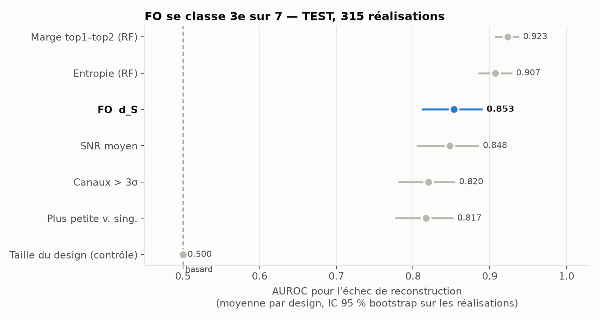
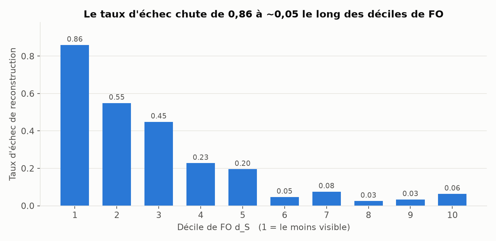
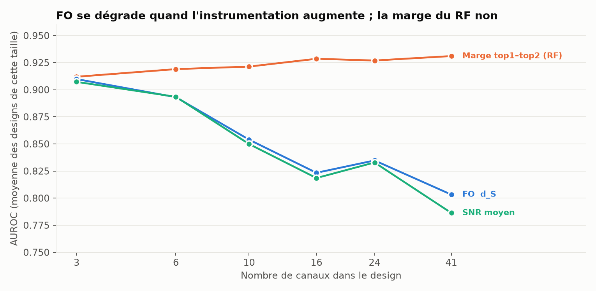
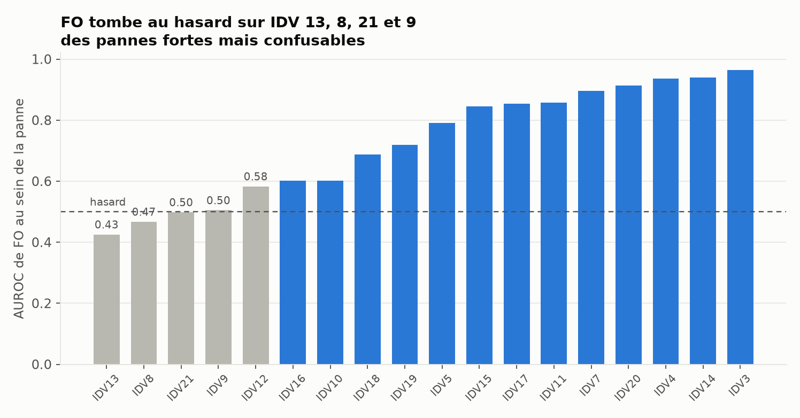
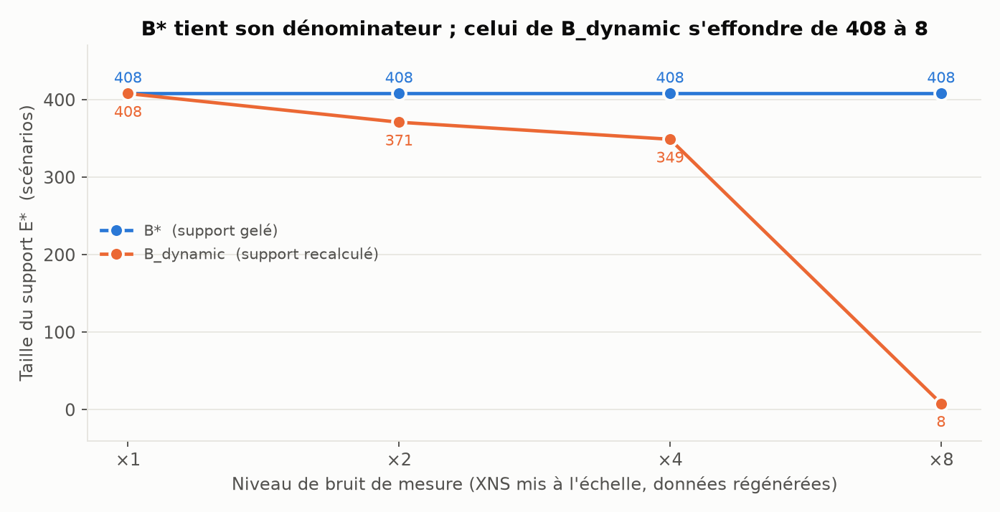

# TEP — Exécution du protocole FO gelé

```
FO_DIAGNOSTIC_TEP:         PARTIALLY_SUPPORTED
FO_RECONSTRUCTIBILITY_TEP: PARTIALLY_SUPPORTED
FO_BEATS_SIMPLE_BASELINES: NO
B_STAR_ADDS_VALUE:         YES
OUT_OF_SAMPLE_ROBUSTNESS:  PASS
TEP_FINAL:                 MIXED
```

Protocole pré-enregistré au commit `cb307f9`, exécuté sans modification.
`src/fo_metrics.py` est inchangé — vérifiable par `git diff`. Aucun seuil, κ, split,
hyperparamètre, endpoint ni baseline n'a été touché après consultation des résultats.
Aucun FO-v2. Les pannes difficiles 3, 9 et 15 sont conservées.

> **TEP est un benchmark simulé externe standard.** Un résultat positif y constitue un
> soutien mécanistique contrôlé, **pas** une validation dans le monde réel. Aucune
> conclusion commerciale et aucune généralisation à l'ADN, aux réseaux réels ou à d'autres
> domaines n'est tirée ici.

---

## 1. Ce qui a été exécuté

| | |
|---|---|
| Perturbations | 21 (IDV 1–21), aucune écartée |
| Graines | 50 par perturbation, liste gelée |
| Réalisations | **1 050** (+ 50 runs normaux appariés partagés par graine) |
| Runs simulateur | **2 750** (1 100 nominaux + 3 × 550 aux niveaux de bruit) |
| Split par graine | 25 / 10 / 15 → **525 / 210 / 315** réalisations |
| Designs de capteurs | 6 tailles × 20 = **120**, tirés sous graine 20260816 avant tout résultat |
| Lignes événementielles | 63 000 (120 designs × 525 réalisations val+test) |
| Unité d'indépendance | la réalisation (panne, graine) — **jamais** le pas de temps |

### Règles d'arrêt : toutes franchies

| Règle | Résultat |
|---|---|
| Exactitude d'entraînement du RF ≥ 0,30 sur le design 41 canaux | **1,000** ✔ |
| E\* ni vide ni total sur TRAIN | **409 / 525** (0,779) ✔ |
| ≥ 30 échecs et ≥ 30 succès en TEST | **9 571 échecs / 28 229 succès** ✔ |

### Deux conventions que le protocole n'avait pas fixées

Déclarées avant tout calcul, dans l'en-tête de `src/phase14_tep_analyse.py` :

1. **IC** : bootstrap percentile sur l'**unité d'indépendance** (la réalisation), 2 000
   rééchantillonnages, graine 20260816. Rééchantillonner les réalisations et non les
   couples (réalisation × design) est ce qui fait respecter la règle 9.
2. **Sens de chaque score** : FO affirme a priori que *peu de visibilité ⇒ difficile*, donc
   le discriminant d'échec est `−d_S`. Chaque baseline reçoit le sens qu'implique sa propre
   signification a priori, fixé une fois et jamais retourné. Une AUROC sous 0,5 signifie donc
   que le score fonctionne **à l'envers** de ce qu'il prétend, et est rapportée comme telle.

**Statistique primaire** : AUROC calculée par design sur les 315 réalisations indépendantes
de TEST, puis moyennée sur les 120 designs. Le bootstrap rééchantillonne les réalisations et
recalcule l'ensemble des AUROC par design.

---

## 2. Résultat principal — le critère gelé échoue



| Métrique | AUROC (TEST) | IC 95 % | AUPRC |
|---|---|---|---|
| Marge top1–top2 (RF) | **0,9231** | [0,9074 ; 0,9374] | 0,7046 |
| Entropie (RF) | **0,9074** | [0,8858 ; 0,9283] | 0,6811 |
| **FO `d_S`** | **0,8530** | **[0,8121 ; 0,8898]** | 0,6386 |
| SNR moyen | 0,8481 | [0,8055 ; 0,8850] | 0,6314 |
| Canaux > 3σ | 0,8203 | [0,7816 ; 0,8540] | 0,5762 |
| Plus petite valeur singulière | 0,8170 | [0,7775 ; 0,8516] | 0,5964 |
| Taille du design (contrôle) | 0,5000 | — | 0,2532 |

Prévalence de l'échec en TEST : 0,2532.

### Application littérale du critère gelé

| Condition | Exigence | Constat | Verdict |
|---|---|---|---|
| C1 | borne inf. de l'IC de FO > 0,5 | 0,8121 > 0,5 | **PASS** |
| C2 | estimation ponctuelle > **toutes** les baselines | 0,8530 < 0,9231 et < 0,9074 | **FAIL** |
| C3 | borne inf. de FO > estimation de la meilleure baseline | 0,8121 < 0,9231 | **FAIL** |

**`FO_SUPPORTED = false`.** Le critère est appliqué tel qu'il a été gelé ; rien n'a été
ajusté après coup.

---

## 3. FO porte un vrai signal — ce n'est pas un échec total



Le taux d'échec chute de façon quasi monotone le long des déciles de `d_S` :

| Décile | 1 | 2 | 3 | 4 | 5 | 6 | 7 | 8 | 9 | 10 |
|---|---|---|---|---|---|---|---|---|---|---|
| Taux d'échec | **0,860** | 0,550 | 0,449 | 0,228 | 0,195 | 0,047 | 0,076 | 0,026 | 0,034 | 0,064 |

Un facteur **13** entre le décile le moins visible et les plus visibles. La monotonie se
casse au-delà du décile 6, où le taux d'échec oscille entre 0,026 et 0,076 sans ordre.

Corrélations de Spearman (TEST) :

| Métrique | log-loss | rang vraie classe |
|---|---|---|
| Entropie (RF) | **+0,967** | +0,653 |
| Marge top1–top2 (RF) | −0,951 | −0,637 |
| **FO `d_S`** | **−0,689** | −0,565 |
| SNR moyen | −0,686 | −0,535 |
| Canaux > 3σ | −0,604 | −0,539 |

FO est un prédicteur réel et solide de la difficulté de reconstruction. Il n'est simplement
pas le meilleur, et l'écart avec les deux premiers est large.

---

## 4. Analyse des échecs

### 4.1 Une baseline simple domine-t-elle FO ? — Oui, deux

L'IC de FO [0,8121 ; 0,8898] est **disjoint** de celui de la marge [0,9074 ; 0,9374]. La
marge du RandomForest domine FO sans ambiguïté ; l'entropie aussi, à un cheveu du
recouvrement.

**Nuance à porter au dossier, sans qu'elle change le verdict** : l'entropie et la marge sont
calculées à partir des postériors du RandomForest lui-même. Ce sont des mesures de la
**confiance de l'observateur en lui-même**, tandis que FO est calculé **sans jamais voir
l'observateur**. Un prédicteur d'échec qui interroge le classifieur a un avantage structurel
sur un prédicteur qui n'a accès qu'au signal physique. Cela dit, ces deux baselines ont été
pré-enregistrées comme des baselines que FO devait battre, avant tout résultat. Les
requalifier maintenant serait exactement le genre d'ajustement post-hoc que le protocole
interdit. **Le critère s'applique tel qu'il a été écrit.**

### 4.2 FO apporte-t-il quelque chose sur un SNR brut ? — Presque rien

C'est le constat le plus défavorable à la **forme** de FO.

| | FO `d_S` | SNR moyen | Écart |
|---|---|---|---|
| AUROC TEST | 0,8530 | 0,8481 | **+0,005** |
| Spearman / log-loss | −0,689 | −0,686 | +0,003 |
| AUPRC | 0,6386 | 0,6314 | +0,007 |

L'écart, +0,005, est **dix-sept fois plus petit** que la largeur de l'IC de FO (0,078). Or
`d_S` est un `max` sur les canaux tandis que le SNR moyen est une simple moyenne de
`|delta|/σ` : la structure spécifique de FO — le maximum, le seuil η, le support E\* — ne
rachète pratiquement rien par rapport à une moyenne élémentaire de rapport signal/bruit.

### 4.3 La performance de FO vient-elle simplement de la taille du design ? — Non



Deux contrôles, tous deux favorables à FO :

- l'analyse primaire est **faite à design constant**, donc la taille du design y est neutralisée
  par construction ; FO y obtient 0,80 à 0,91 selon la taille ;
- dans l'analyse poolée (indépendance violée, rapportée pour ce seul contrôle), la taille du
  design seule obtient une AUROC de **0,670**, contre **0,861** pour FO.

FO porte donc bien de l'information au-delà de la taille du design.

En revanche, **FO se dégrade quand l'instrumentation augmente** : 0,910 à 3 canaux, 0,803 à
41 canaux, alors que la marge du RF reste plate autour de 0,92 et progresse même légèrement.
FO est donc le plus utile quand les capteurs sont rares — ce qui est cohérent avec sa raison
d'être — mais c'est précisément là qu'un SNR moyen fait aussi bien (0,907 contre 0,910).

### 4.4 Quelles perturbations FO comprend, lesquelles il ne comprend pas



Trois pannes (IDV 1, 2, 6) sont diagnostiquées sans aucune erreur, donc leur AUROC est
indéfinie. Sur les 18 restantes :

**FO comprend bien** (AUROC ≥ 0,90) :

| Panne | AUROC FO | Taux d'échec |
|---|---|---|
| IDV 3 | **0,965** | 0,526 |
| IDV 14 | 0,940 | 0,318 |
| IDV 4 | 0,936 | 0,452 |
| IDV 20 | 0,914 | 0,054 |

IDV 3 est l'une des pannes réputées quasi indétectables, et FO y est excellent. IDV 15, autre
panne difficile, donne FO 0,845 contre 0,752 pour l'entropie et 0,634 pour la marge : **sur
cette panne, FO bat les deux baselines qui le dominent globalement.**

**FO ne comprend pas** (AUROC ≤ 0,51, soit au niveau du hasard ou à l'envers) :

| Panne | AUROC FO | AUROC entropie | AUROC marge | Taux d'échec | `d_S` médian |
|---|---|---|---|---|---|
| IDV 13 | **0,425** | 0,898 | 0,954 | 0,098 | 725,0 |
| IDV 8 | **0,467** | 0,888 | 0,967 | 0,020 | 507,5 |
| IDV 21 | **0,498** | 0,813 | 0,486 | 0,802 | 0,0 |
| IDV 9 | **0,505** | 0,533 | 0,361 | 0,821 | 11,7 |

Le motif est net et mécaniquement interprétable. IDV 13 et IDV 8 ont un `d_S` médian très
élevé (725 et 508) : le signal est **fort**, et pourtant l'observateur échoue — parce que la
panne est **confusable** avec une autre, pas parce qu'elle est invisible. FO, qui ne mesure
qu'une amplitude relative au bruit, n'a aucun moyen de voir cela ; l'entropie du classifieur,
si (0,898 et 0,888).

Symétriquement, IDV 21 a un `d_S` médian de **0** — aucune déviation observable — et un taux
d'échec de 0,80 : FO devrait exceller, mais comme *toutes* les réalisations de cette panne
sont également invisibles, il n'a plus de variance à exploiter au sein de la panne.

**Conclusion mécanistique** : FO diagnostique la perte d'information par **atténuation du
signal**, et il le fait bien. Il est aveugle à la perte d'information par **ambiguïté entre
états** — un signal fort mais non distinctif. C'est exactement la limite structurelle
identifiée lors du gate Digits, ici mesurée sur un benchmark où FO est proprement défini.

### 4.5 B\* apporte-t-il réellement quelque chose sur B_dynamic ? — Oui, démonstrativement



Population TRAIN, données **régénérées** à chaque niveau de bruit physique (XNS mis à
l'échelle), 120 designs :

| Bruit | Support B\* | Support B_dynamic | B\* moyen | B_dynamic moyen | Designs qui diffèrent |
|---|---|---|---|---|---|
| ×1 | 408 | 408 | 0,0282 | 0,0282 | 0 % |
| ×2 | **408** | 371 | 0,0514 | 0,0423 | **100 %** |
| ×4 | **408** | 349 | 0,0717 | **0,0108** | **100 %** |
| ×8 | **408** | **8** | 0,7451 | 0,6167 | **100 %** |

Le dénominateur de B\* est rigoureusement constant ; celui de B_dynamic s'effondre de 408 à
**8 scénarios** — 2 % de la population — sous bruit ×8, où il ne mesure plus rien
d'interprétable. Pire, **B_dynamic est non monotone en bruit** : il *descend* de 0,042 (×2) à
0,011 (×4) avant de remonter, exactement la pathologie que B\* a été construit pour corriger.
B\*, lui, croît monotonement : 0,028 → 0,051 → 0,072 → 0,745.

**B\* fait ce qu'il promet.** C'est le résultat le plus net de cette phase, et il est
favorable.

**Calibration de B\*** : sur TEST, Spearman entre B\*(S) et le taux d'échec observé du design
= **+0,633** (p ≈ 0), donc B\* **classe** correctement les designs. Mais B\* moyen vaut 0,0282
contre un taux d'échec observé de 0,2532 — il **sous-estime l'échec d'un facteur 9**. Score
de Brier 0,0635. **Ordonnancement : oui. Calibration en niveau : non.**

### 4.6 Stabilité hors échantillon

| Métrique | VAL (n=210) | TEST (n=315) | Écart | Rang VAL | Rang TEST |
|---|---|---|---|---|---|
| Entropie (RF) | 0,9255 | 0,9074 | −0,018 | 1 | 2 |
| Marge top1–top2 | 0,9196 | 0,9231 | +0,004 | 2 | 1 |
| **FO `d_S`** | **0,8998** | **0,8530** | **−0,047** | **3** | **3** |
| SNR moyen | 0,8994 | 0,8481 | −0,051 | 4 | 4 |
| Plus petite v. sing. | 0,8651 | 0,8170 | −0,048 | 5 | 6 |
| Canaux > 3σ | 0,8627 | 0,8203 | −0,042 | 6 | 5 |

Les IC de FO se recouvrent entre les deux splits ([0,8676 ; 0,9315] contre
[0,8121 ; 0,8898]). Le **classement est préservé** : FO troisième dans les deux cas, SNR
quatrième dans les deux cas, entropie et marge occupant les deux premières places dans un
ordre interverti. Le niveau absolu baisse de 0,047 sur TEST, une dérive modérée et commune à
toutes les métriques physiques (−0,042 à −0,051), donc attribuable à la difficulté du split
plutôt qu'à un surapprentissage de FO — qui n'a d'ailleurs rien à surapprendre, n'ayant aucun
paramètre ajusté.

**Verdict : PASS.**

---

## 5. Incident de génération, rapporté

Sur les 2 750 runs, **un seul** est tronqué : panne 5, graine d'indice 3, au niveau de bruit
×4, où le procédé déclenche sa propre condition d'arrêt d'urgence. Ce n'est pas un défaut du
harness mais un comportement du procédé sous bruit de mesure quadruplé.

Une comparaison entre niveaux de bruit exige une population identique d'un niveau à l'autre ;
la comparaison B\*/B_dynamic tourne donc sur les scénarios présents à **tous** les niveaux,
soit 524 des 525. **Cela retire une donnée absente, cela ne déplace aucun seuil.**

---

## 6. Verdicts

```
FO_DIAGNOSTIC_TEP:         PARTIALLY_SUPPORTED
FO_RECONSTRUCTIBILITY_TEP: PARTIALLY_SUPPORTED
FO_BEATS_SIMPLE_BASELINES: NO
B_STAR_ADDS_VALUE:         YES
OUT_OF_SAMPLE_ROBUSTNESS:  PASS
TEP_FINAL:                 MIXED
```

**`FO_DIAGNOSTIC_TEP : PARTIALLY_SUPPORTED`** — FO discrimine l'échec de reconstruction
nettement au-dessus du hasard (0,853, IC [0,812 ; 0,890]), avec des déciles massivement
ordonnés et un Spearman de −0,689 contre la log-loss. Mais il échoue au critère
pré-enregistré, et il tombe au niveau du hasard sur 4 des 18 pannes évaluables.

**`FO_RECONSTRUCTIBILITY_TEP : PARTIALLY_SUPPORTED`** — même corpus de preuves : à partir de
l'information encore observable, FO prédit réellement qu'un observateur indépendant retrouvera
l'état d'origine, mais seulement dans le régime où la perte d'information est une atténuation
de signal, et pas mieux que des alternatives élémentaires.

**`FO_BEATS_SIMPLE_BASELINES : NO`** — la barre gelée était « toutes les baselines ». FO en
bat trois nettement (canaux > 3σ, plus petite valeur singulière, taille du design), en égale
une dans le bruit statistique (SNR moyen, +0,005) et en perd deux de façon décisive (entropie,
marge). Le fait le plus dommageable n'est pas la défaite face aux deux premières, c'est
l'égalité avec le SNR moyen : la structure propre de FO ne rachète rien.

**`B_STAR_ADDS_VALUE : YES`** — support invariant à 408 contre un effondrement à 8, et
non-monotonie de B_dynamic corrigée. B\* répare bien ce pour quoi il a été conçu. Sa
calibration en niveau reste mauvaise (sous-estimation d'un facteur 9), son ordonnancement est
correct (ρ = +0,633).

**`OUT_OF_SAMPLE_ROBUSTNESS : PASS`** — classement préservé, IC recouvrants, dérive de niveau
commune à toutes les métriques physiques.

**`TEP_FINAL : MIXED`** — ni soutien mécanistique franc, ni falsification. FO est un
diagnostic réel mais non dominant, structurellement limité à la perte par atténuation, et
n'apportant presque rien sur une moyenne de SNR. B\* est validé comme réparation de
B_dynamic. Aucun ajustement n'a été tenté après l'échec du critère, conformément aux
règles 8 et 9.

Encore une fois : **TEP est un benchmark simulé**. Ce qui précède est un résultat contrôlé
sur simulateur, rien de plus.

---

## 7. Livrables

```
phase14_tep/RAPPORT_TEP_TEST_FO.md               ce rapport
phase14_tep/PROTOCOLE_PREENREGISTRE_TEP.json     protocole gelé (inchangé)
phase14_tep/results/VERDICT_TABLES.json          toutes les tables
phase14_tep/results/EVENT_LEVEL_TEP.csv.gz       63 000 lignes événementielles
phase14_tep/results/PER_DESIGN_METRICS.csv       120 designs x 2 splits
phase14_tep/results/{primary_auroc,pooled_auroc,spearman,deciles,per_fault,
                     auprc,by_design_size,b_star_vs_dynamic,
                     b_star_calibration}.csv
phase14_tep/results/STOPPING_RULES.json          règles d'arrêt vérifiées
phase14_tep/figures/fig1..fig5.png               figures
phase14_tep/logs/{generation,analyse,verdict}.log
phase14_tep/SHA256SUMS.txt                       empreintes
src/phase14_tep_{harness,generate,analyse,verdict,figures}.py
```

`src/fo_metrics.py` est inchangé.
