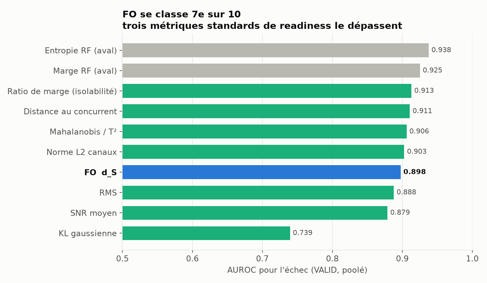
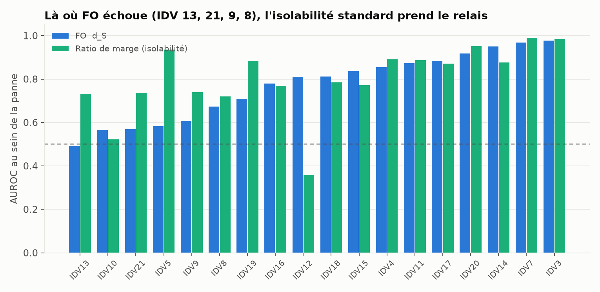
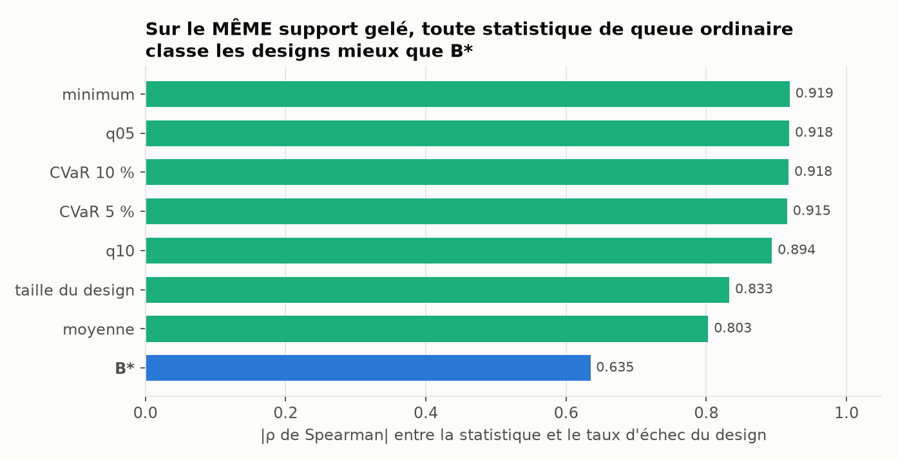
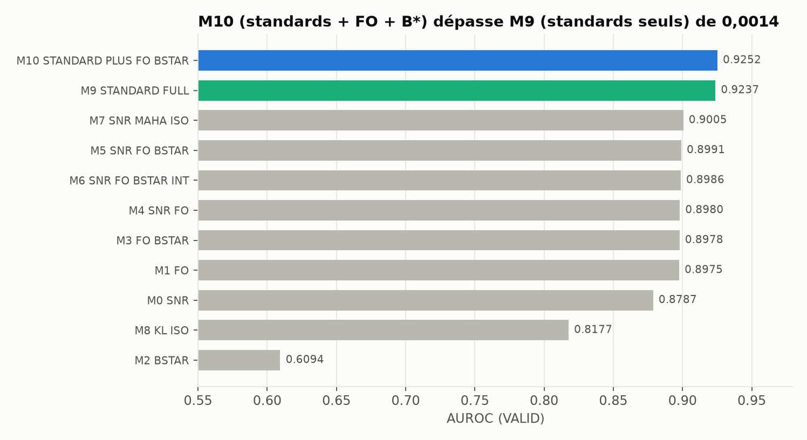
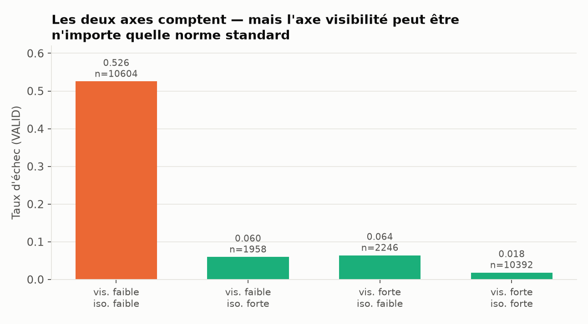

# Phase 15 — Autopsie exploratoire FO / B\* sur les données TEP Phase 14

> **EXPLORATOIRE.** Rien ici ne confirme quoi que ce soit. Les modèles sont ajustés sur TRAIN
> et comparés sur VALID uniquement. Le TEST de Phase 14 n'a servi à choisir aucune décision.
> La confirmation est le rôle de la Phase 16, sur des graines entièrement nouvelles.

`src/fo_metrics.py` est inchangé. Aucun FO-v2. Les 21 perturbations sont conservées, y compris
IDV 3, 9, 15 et 21.

**Données** : Phase 14, 1 050 réalisations × 120 designs = 126 000 lignes. Labels TRAIN
cross-fittés en 5 plis groupés par graine, pour que TRAIN soit exploitable sans fuite.

---

## Résultat le plus important, d'abord

**FO n'est pas une métrique nouvelle : `d_S` *est* `max_{j∈S,t} |δ_j|/σ_j`.**

```
max |fo_d_S − max_abs|  =  0.000e+00   sur les 126 000 lignes
```

Ce n'est pas une approximation ni une corrélation forte : c'est la même statistique, calculée
par deux chemins de code différents. Tout ce qui suit doit se lire à cette lumière — la
question n'est pas « FO apporte-t-il de l'information ? » mais « le **maximum** apporte-t-il
quelque chose que la moyenne, la RMS, la norme L2 ou Mahalanobis n'ont pas déjà ? ».

---

## A — Visibilité

### A.1 Classement des métriques seules (VALID, poolé)



| Rang | Métrique | Famille | AUROC | AUPRC |
|---|---|---|---|---|
| 1 | Entropie RF | **aval** | 0,9376 | 0,7918 |
| 2 | Marge RF | **aval** | 0,9252 | 0,7151 |
| 3 | Ratio de marge | isolabilité | **0,9130** | 0,7804 |
| 4 | Distance au concurrent | isolabilité | **0,9106** | 0,7804 |
| 5 | Mahalanobis / T² | visibilité std | **0,9061** | 0,7506 |
| 6 | Norme L2 canaux | visibilité std | **0,9027** | 0,7388 |
| **7** | **FO `d_S`** | **FO** | **0,8975** | 0,7312 |
| 8 | RMS | visibilité std | 0,8878 | 0,7153 |
| 9 | SNR moyen | visibilité std | 0,8787 | 0,7002 |
| 10 | KL gaussienne | visibilité std | 0,7395 | 0,3375 |

FO bat le SNR moyen (+0,019), la RMS (+0,010) et la KL. Il est **dépassé par quatre
métriques standards**, dont trois sont des métriques de readiness indépendantes du
classifieur : Mahalanobis (+0,009 sur FO), la norme L2 des canaux (+0,005), et les deux
mesures d'isolabilité (+0,013 et +0,016).

### A.2 FO est quasi colinéaire à une norme standard

Spearman contre `d_S` sur TRAIN, en échelle log :

| Métrique | ρ Spearman | ρ Pearson |
|---|---|---|
| **Norme L2 canaux** | **+0,9925** | **+0,9952** |
| RMS | +0,9689 | +0,9527 |
| SNR moyen | +0,9349 | +0,8923 |
| Mahalanobis | +0,8464 | +0,6295 |
| KL gaussienne | +0,5451 | +0,4714 |

Information mutuelle avec l'échec : FO 0,480 bit, SNR moyen 0,322 bit — FO en porte
davantage que la moyenne, mais la norme L2, qui lui est colinéaire à 0,993, en porte encore
plus tout en étant strictement standard.

### A.3 L'ablation décisive : FO est **interchangeable** avec la norme L2

| Modèle | AUROC (VALID) |
|---|---|
| M9 standard complet | 0,9237 |
| M9 avec `l2_channels` **remplacé par** `fo_d_S` | **0,9234** |
| M9 sans `l2_channels` | 0,9222 |
| M9 sans `l2_channels`, **plus** `fo_d_S` | **0,9234** |
| M10 = M9 + FO + B\* | 0,9252 |

Substituer FO à la norme L2 coûte **0,0003 d'AUROC**. FO et une norme standard sont
substituables l'un à l'autre à trois décimales près. FO n'est pas un ajout au dispositif
standard : c'en est une variante.

### A.4 Domaine de définition de la KL

La KL gaussienne exige un `Σ_f` non dégénéré. **IDV 21 produit une déviation nulle à la
précision machine sur les 50 graines** (`mean_abs ≤ 4·10⁻⁵`), donc `Σ_f` est singulière et la
divergence vaut `+inf` — **indéfinie**, pas grande. C'est 6 000 lignes sur 126 000, une seule
panne, couverture 95,2 %.

Traitement : indicateur de manquant standard, imputation à la médiane TRAIN des valeurs
finies. Mapper `+inf` vers « KL élevée » aurait affirmé que ces réalisations sont très
détectables, ce qui est exactement l'inverse : l'infini vient de `−ln det Σ_f` qui explose sur
une masse de Dirac, pas d'un signal. **IDV 21 n'est jamais retirée** — c'est la panne au plus
fort taux d'échec (0,832).

---

## B — Isolabilité : ce que FO ne voit pas



Les quatre pannes où FO était faible en Phase 14, avec les métriques d'isolabilité
**indépendantes du classifieur** :

| Panne | Taux d'échec | `d_S` médian | AUROC FO | AUROC dist. concurrent | AUROC ratio de marge | AUROC Mahalanobis |
|---|---|---|---|---|---|---|
| IDV 13 | 0,027 | **743,2** | 0,491 | 0,480 | **0,733** | 0,294 |
| IDV 21 | 0,832 | **0,0** | 0,570 | **0,734** | **0,734** | 0,575 |
| IDV 9 | 0,734 | 11,7 | 0,608 | **0,740** | **0,740** | 0,741 |
| IDV 8 | 0,035 | **481,0** | 0,674 | **0,732** | 0,721 | 0,731 |

**Sur les quatre, une métrique standard d'isolabilité fait mieux que FO**, de +0,06 à +0,24
d'AUROC. Le motif mécanistique de Phase 14 est confirmé et quantifié : IDV 13 et IDV 8 ont un
signal très fort (`d_S` de 743 et 481) et échouent quand même, parce qu'elles sont
**confusables** ; le ratio de marge le voit, FO non. Mahalanobis échoue aussi sur IDV 13
(0,294, sous le hasard), donc ce n'est pas « n'importe quelle métrique standard » — c'est
spécifiquement l'**isolabilité** qui rattrape.

Cas particulier IDV 21 : `d_S` médian nul, distance au concurrent nulle. La panne est
invisible **et** inséparable. L'isolabilité y obtient tout de même 0,734, contre 0,570 pour FO.

---

## C — B\* : structurel contre opérationnel

### C.1 B\*_STRUCTURAL — confirmé (déjà établi en Phase 14)

Support figé à 408 pendant que celui de B_dynamic s'effondre 408 → 371 → 349 → 8 sous bruit
×1 → ×8, avec une non-monotonie de B_dynamic (0,042 à ×2, 0,011 à ×4). B\* corrige bien le
défaut pour lequel il a été construit. Ce point sera re-testé en aveugle en Phase 16 (H4).

### C.2 B\*_OPERATIONAL — la valeur vient du support fixe, pas de B\*



Toutes les statistiques ci-dessous sont calculées sur **le même** support gelé `E*` et les
**mêmes** valeurs `d_S`. Cible : le taux d'échec observé du design.

| Statistique | \|ρ\| VALID | \|ρ\| TEST |
|---|---|---|
| minimum | **0,919** | **0,934** |
| q05 | **0,918** | 0,932 |
| CVaR 10 % | 0,918 | **0,936** |
| CVaR 5 % | 0,915 | 0,930 |
| q10 | 0,894 | 0,914 |
| taille du design | 0,833 | 0,835 |
| moyenne | 0,803 | 0,828 |
| **B\*** | **0,635** | **0,633** |

C'est la réponse à la question centrale posée sur B\* : **la valeur opérationnelle vient du
support fixe, pas de la construction de B\***. Un simple minimum, ou un quantile à 5 %, ou une
CVaR, appliqués au même support, classent les designs bien mieux que B\* lui-même — et B\* est
même battu par la simple taille du design.

Le comptage sous seuil `η` est une **perte d'information** : il écrase une distribution
continue en une proportion binaire, et le seuil `η = 3` est trop bas pour discriminer les
designs riches, où presque aucun scénario ne tombe sous le seuil.

**Calibration** : B\* moyen 0,028 contre un taux d'échec observé de 0,239 — **sous-estimation
d'un facteur 8,5**. Brier au niveau design 0,0576.

---

## D — L'échelle des modèles



| Modèle | AUROC | AUPRC | Brier | log-loss |
|---|---|---|---|---|
| M2 B\* | 0,6094 | 0,3169 | 0,1753 | 0,5329 |
| M8 KL + iso KL | 0,8177 | 0,5622 | 0,1422 | 0,4282 |
| M0 SNR | 0,8787 | 0,7002 | 0,1186 | 0,3728 |
| M1 FO | 0,8975 | 0,7312 | 0,1054 | 0,3358 |
| M3 FO + B\* | 0,8978 | 0,7262 | 0,1049 | 0,3352 |
| M4 SNR + FO | 0,8980 | 0,7313 | 0,1057 | 0,3369 |
| M6 SNR + FO + B\* + interaction | 0,8986 | 0,7434 | 0,1044 | 0,3355 |
| M5 SNR + FO + B\* | 0,8991 | 0,7277 | 0,1047 | 0,3360 |
| M7 SNR + Mahalanobis + iso | 0,9005 | 0,7158 | 0,1089 | 0,3420 |
| **M9 ensemble standard, sans FO/B\*** | **0,9237** | **0,8065** | **0,0909** | **0,2927** |
| **M10 = M9 + FO + B\*** | **0,9252** | **0,8143** | **0,0891** | **0,2883** |

Comparaisons appariées, bootstrap 2 000 tirages **groupés par graine** :

| Comparaison | Question | Δ AUROC | IC 95 % | IC exclut 0 |
|---|---|---|---|---|
| M9 vs M0 | l'ensemble standard vaut-il mieux que le SNR ? | **+0,0450** | [0,0337 ; 0,0549] | oui |
| M10 vs M7 | vs standard compact | +0,0246 | [0,0176 ; 0,0309] | oui |
| M4 vs M0 | **H2 — FO au-delà du SNR** | **+0,0193** | [0,0112 ; 0,0263] | oui |
| M1 vs M0 | FO seul vs SNR seul | +0,0188 | [0,0126 ; 0,0242] | oui |
| **M10 vs M9** | **H8 — apport propre au projet** | **+0,0014** | **[0,0005 ; 0,0022]** | **oui** |
| M5 vs M4 | B\* par-dessus SNR+FO | +0,0011 | [0,0003 ; 0,0019] | oui |
| M3 vs M1 | **H6 — B\* ajoute à FO** | +0,0003 | [−0,0005 ; 0,0010] | **non** |
| M6 vs M5 | terme d'interaction FO×B\* | **−0,0005** | [−0,0013 ; 0,0004] | non |
| M3 vs M2 | FO ajoute à B\* | +0,2884 | [0,2671 ; 0,3106] | oui |

Lecture, en gardant à l'esprit le seuil de pertinence pratique de **0,02** fixé pour la
Phase 16 :

- **H2 est à la limite.** FO bat le SNR moyen de +0,0193, soit juste sous 0,02. Mais ce
  « SNR » est la moyenne ; contre la norme L2, FO ne gagne rien du tout (§A.3).
- **H8 est positif mais minuscule.** +0,0014, quatorze fois sous le seuil de pertinence.
  L'IC exclut zéro — l'effet est réel — mais il serait classé **WEAK**, pas YES.
- **B\* n'ajoute rien à FO** : +0,0003, IC contenant zéro.
- **L'interaction FO×B\* est négative.**

---

## E — Décomposition Visibilité / Isolabilité



Seuils = médianes TRAIN, appliqués à VALID :

| Régime | n | Taux d'échec | Rang médian | log-loss médiane |
|---|---|---|---|---|
| visibilité faible / isolabilité faible | 10 604 | **0,526** | 2,0 | 1,551 |
| visibilité faible / isolabilité forte | 1 958 | 0,060 | 1,0 | 0,269 |
| visibilité forte / isolabilité faible | 2 246 | 0,064 | 1,0 | 0,170 |
| visibilité forte / isolabilité forte | 10 392 | **0,018** | 1,0 | 0,051 |

Les quatre régimes correspondent bien à des taux d'échec très différents — d'un facteur 29
entre le pire et le meilleur — et les deux axes sont nécessaires : la dégradation ne survient
que lorsque **les deux** sont faibles.

**Mais l'axe de visibilité n'a pas besoin d'être FO.** Écart de taux d'échec entre régimes
extrêmes selon l'axe choisi :

| Axe de visibilité | Écart |
|---|---|
| FO `d_S` | 0,5072 |
| **Norme L2 canaux (standard)** | **0,5071** |
| Mahalanobis (standard) | 0,4493 |

FO et la norme L2 donnent la même décomposition à la quatrième décimale. **L'architecture est
utile ; sa composante FO ne l'est pas spécifiquement.**

---

## Synthèse exploratoire, à confirmer en Phase 16

1. `d_S` de FO **est** `max |δ|/σ`, une statistique d'ordre élémentaire, pas une métrique
   nouvelle.
2. FO est **quasi colinéaire** (ρ = 0,993) à la norme L2 des canaux, et **interchangeable**
   avec elle dans l'ensemble complet à 0,0003 d'AUROC près.
3. FO **bat** le SNR moyen (+0,019) mais est **battu** par Mahalanobis, la norme L2 et les
   deux métriques d'isolabilité.
4. L'apport de FO+B\* à l'ensemble standard est **réel mais minuscule** : +0,0014, quatorze
   fois sous le seuil de pertinence pratique.
5. La valeur opérationnelle de B\* vient du **support fixe**, pas de sa construction : min,
   q05 et CVaR le battent tous largement (0,92 contre 0,63).
6. L'isolabilité standard **explique** les quatre pannes où FO échoue.
7. La décomposition Visibilité/Isolabilité **a une valeur prédictive**, mais son axe de
   visibilité peut être n'importe quelle norme standard.

Ces sept points sont **exploratoires**. La Phase 16 les teste en aveugle sur 1 050
réalisations issues de graines entièrement nouvelles.

---

## Fichiers

```
RAPPORT_PHASE15_EXPLORATOIRE.md   ce rapport
STANDARD_METRICS_AUDIT.md         formules, références, indépendance vis-à-vis de FO
PHASE15_TABLES.json               toutes les tables
FEATURES_PHASE15.csv.gz           126 000 lignes
INCREMENTAL_VALUE.csv             échelle des modèles M0-M10
ABLATIONS.csv                     comparaisons appariées
FAULT_CONFUSABILITY.csv           par panne
BSTAR_COMPARISON.csv              B* contre les statistiques de queue
STANDARD_METRICS_AUDIT.csv        AUROC par métrique
MODEL_COEFFICIENTS.json           coefficients ajustés sur TRAIN
figures/                          5 figures
logs/                             journaux d'exécution
```
