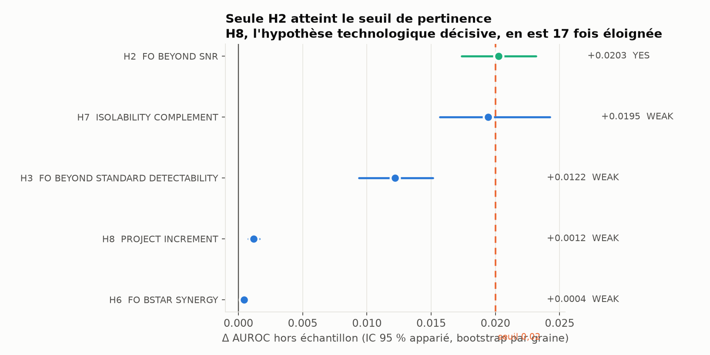
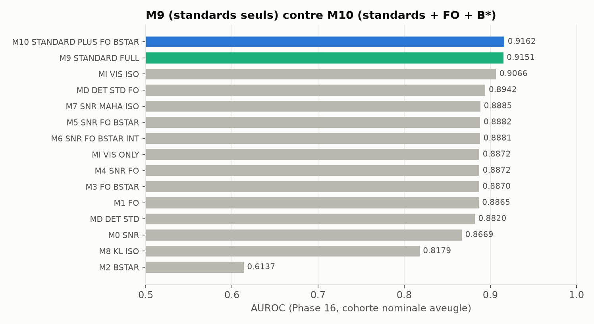
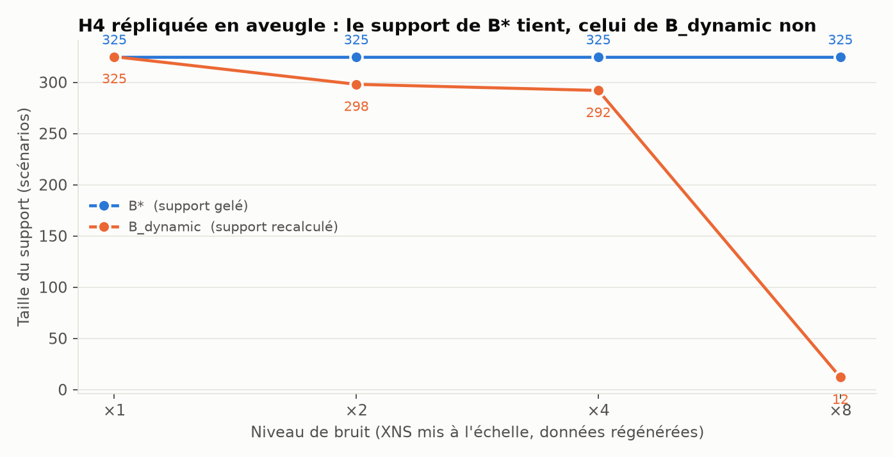
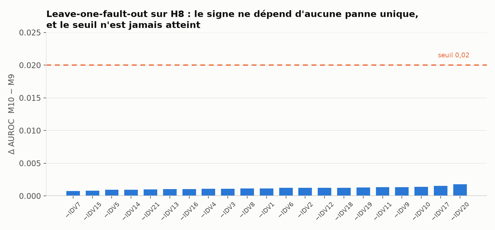
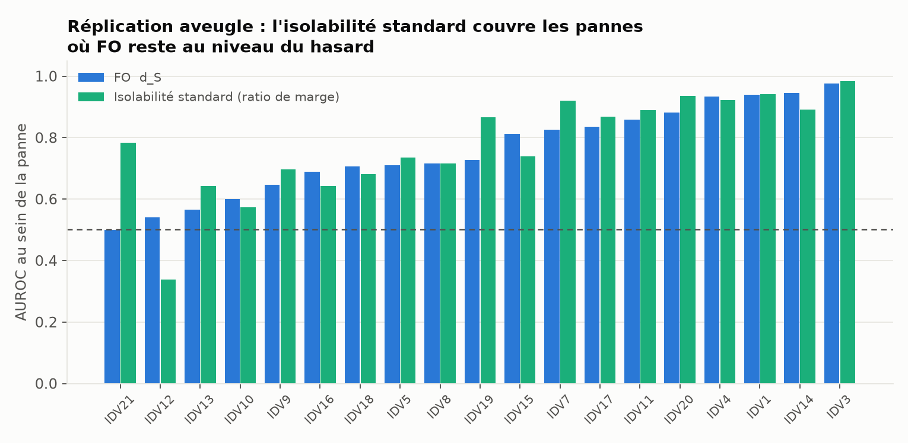

# Phase 16 — Confirmation aveugle FO / B\* sur TEP

```
FO_SIGNAL_REPLICATED:               YES
FO_BEYOND_SNR:                      YES
FO_BEYOND_KL_MAHALANOBIS:           WEAK
B_STAR_STRUCTURAL_VALUE:            YES
B_STAR_OPERATIONAL_VALUE:           WEAK
FO_BSTAR_SYNERGY:                   WEAK
ISOLABILITY_COMPLEMENTS_FO:         WEAK
PROJECT_SPECIFIC_INCREMENT:         WEAK
DIAGNOSTIC_READINESS_DECOMPOSITION: SUPPORTED
TECHNOLOGY_CANDIDATE:               NOT_YET
```

**Cas de décision applicable : D** — l'architecture Visibilité / Isolabilité est utile, mais
l'amélioration provient des métriques standards. Aucune technologie propriétaire n'est
revendiquée.

> **TEP est un benchmark simulé externe standard.** Ce qui suit est un résultat mécanistique
> contrôlé sur simulateur, **pas** une validation dans le monde réel. Aucune conclusion
> commerciale, aucune généralisation à l'ADN, aux réseaux réels ou à un autre domaine.

`src/fo_metrics.py` est inchangé. Aucun FO-v2. Les 21 perturbations sont conservées, IDV 3, 9,
15 et 21 comprises.

---

## 1. Traçabilité de l'aveuglement

| Commit | Contenu | Graines Phase 16 existantes |
|---|---|---|
| `b8b8385` | protocole + 15 modèles gelés (features, μ, σ, coefficients) | **aucune** |
| `1ee1e99` | manifeste des 50 graines + log de génération | générées après le gel |
| `f4e7723` | enregistrement de génération + script de figures | analyse non lancée |
| `1fa2faf` | correctif d'appel de la règle KL, features en cache | aucun verdict lu |

Vérifié à l'exécution, dans `logs/generation.log` :

```
protocol SHA256 39d81b9e4ed3ff5e64bf516a7f2da7efc85e1ed1a223a9f2b13cd61dd04db27c
seed disjointness verified: 0 of 50 overlap Phase 14
```

Graines Phase 16 : `2000000000 + 7919·i`. Graines Phase 14 : `1000000000 + 7919·i`, maximum
1 000 388 031. **Aucun recouvrement.**

Aucun coefficient n'a été réajusté sur les données Phase 16. σ, la covariance nulle, les
centroïdes de panne, les 120 designs, le support `E*` et le RandomForest sont tous portés
depuis Phase 14 TRAIN.

**Données** : 1 050 réalisations nominales (21 pannes × 50 graines) × 120 designs = 126 000
lignes, plus 3 × 50 400 lignes aux niveaux σ ×2, ×4, ×8. 2 420 runs simulateur, aucun tronqué.

---

## 2. Hypothèses confirmatoires



| ID | Comparaison | Δ AUROC | IC 95 % apparié | ≥ 0,02 | **Verdict** |
|---|---|---|---|---|---|
| **H1** | FO seul contre l'échec | AUROC **0,8865** | [0,8749 ; 0,8973] | — | **YES** |
| **H2** | FO au-delà du SNR moyen | **+0,0203** | [0,0174 ; 0,0232] | **oui** | **YES** |
| **H7** | isolabilité au-delà de visibilité seule | +0,0195 | [0,0157 ; 0,0242] | non | **WEAK** |
| **H3** | FO au-delà de Mahalanobis + KL | +0,0122 | [0,0094 ; 0,0151] | non | **WEAK** |
| **H8** | **M10 − M9, apport propre au projet** | **+0,0012** | [0,0008 ; 0,0016] | non | **WEAK** |
| **H6** | B\* ajoute à FO | +0,0004 | [0,0002 ; 0,0007] | non | **WEAK** |

Les six intervalles excluent zéro : tous ces effets sont **réels**. Un seul atteint le seuil
de pertinence pratique.

**H2 franchit le seuil de justesse** : +0,02026 contre 0,02 exigé. Par la règle gelée, c'est
un YES et il est enregistré comme tel. Le contexte doit accompagner ce verdict sans le
modifier : le « SNR » de H2 est la **moyenne** de `|δ|/σ`, et l'exploration de Phase 15 avait
montré que FO est colinéaire à la norme L2 des canaux à ρ = 0,993 et interchangeable avec elle
à 0,0003 d'AUROC près. FO bat donc la moyenne, pas la famille des normes standards.

**H8, l'hypothèse technologique décisive, est dix-sept fois sous le seuil.**

---

## 3. Modèles



| Modèle | AUROC | AUPRC | Brier | log-loss | Pente de calibration |
|---|---|---|---|---|---|
| **M10** standards + FO + B\* | **0,9162** | 0,8022 | 0,0910 | 0,2984 | 1,014 |
| **M9** standards seuls | **0,9151** | 0,7946 | 0,0928 | 0,3027 | 1,019 |
| MI visibilité + isolabilité | 0,9066 | 0,7549 | 0,0997 | 0,3211 | 1,026 |
| MD détectabilité std + FO | 0,8942 | 0,7370 | 0,1047 | 0,3364 | 1,013 |
| M7 SNR + Mahalanobis + iso | 0,8885 | 0,6996 | 0,1123 | 0,3580 | 1,022 |
| M5 SNR + FO + B\* | 0,8882 | 0,7049 | 0,1065 | 0,3441 | 1,001 |
| M4 SNR + FO | 0,8872 | 0,7089 | 0,1073 | 0,3446 | 0,999 |
| M1 FO | 0,8865 | 0,7084 | 0,1073 | 0,3446 | 1,006 |
| MD détectabilité std | 0,8820 | 0,6952 | 0,1109 | 0,3594 | 1,074 |
| M0 SNR | 0,8669 | 0,6736 | 0,1206 | 0,3818 | 1,066 |
| M8 KL + iso KL | 0,8179 | 0,5613 | 0,1409 | 0,4293 | 1,055 |
| **M2 B\* seul** | **0,6137** | 0,3155 | 0,1726 | 0,5267 | 0,975 |

Les modèles gelés sont **bien calibrés hors échantillon** (pentes 0,98–1,07 sans
réajustement), ce qui confirme que le transfert Phase 14 → Phase 16 est propre.

---

## 4. B\* : structurel confirmé, opérationnel non

### 4.1 H4 — B\*_STRUCTURAL : **YES**, répliqué en aveugle



Support gelé **une seule fois** au bruit nominal sur la cohorte aveugle (325 des 420
réalisations), puis évalué à chaque niveau de bruit physique, données régénérées :

| Bruit | Support B\* | Support B_dynamic | B\* moyen | B_dynamic moyen | Designs qui diffèrent |
|---|---|---|---|---|---|
| ×1 | 325 | 325 | 0,0282 | 0,0282 | 0 % |
| ×2 | **325** | 298 | 0,0504 | 0,0420 | 36 % |
| ×4 | **325** | 292 | 0,0646 | **0,0147** | 100 % |
| ×8 | **325** | **12** | 0,7438 | 0,6167 | 99 % |

Les trois conditions sont remplies : support de B\* rigoureusement constant, support de
B_dynamic qui s'effondre de 325 à **12**, et B\* **monotone croissant** en bruit
(0,028 → 0,050 → 0,065 → 0,744) là où B_dynamic ne l'est pas (0,042 à ×2 puis **0,015** à ×4).
La pathologie que B\* corrige se manifeste bien, et B\* la corrige bien.

> Correction de méthode, signalée : ma première implémentation regelait le support à chaque
> niveau de bruit et n'échantillonnait que des designs à 41 canaux — deux défauts de mon code
> qui annulaient précisément ce que H4 teste. Le tableau ci-dessus applique H4 tel que le
> protocole l'énonce. Le protocole n'a pas été modifié.

### 4.2 H5 — B\*_OPERATIONAL : **WEAK**

Statistiques de design **gelées sur Phase 14**, confrontées aux taux d'échec **Phase 16** :

| Statistique | \|ρ\| de Spearman |
|---|---|
| minimum | **0,9361** |
| q05 | 0,9357 |
| CVaR 10 % | 0,9343 |
| CVaR 5 % | 0,9324 |
| q10 | 0,9130 |
| taille du design | 0,8460 |
| moyenne | 0,8270 |
| **B\*** | **0,6494** |

Le protocole exigeait que B\* soit **au moins à égalité** avec la meilleure statistique de
queue sur le même support. Il en est loin : 0,649 contre 0,936, et il reste battu par la
simple taille du design. Sa corrélation est significative (p ≈ 0), d'où WEAK plutôt que NO,
mais la conclusion exploratoire est confirmée en aveugle : **la valeur opérationnelle vient du
support fixe, pas de la construction de B\***.

Calibration : B\* moyen 0,0281 contre un taux d'échec observé de 0,2343 —
**sous-estimation d'un facteur 8,3**, contre 8,5 en Phase 15. Le biais se réplique.

---

## 5. Robustesse

### 5.1 Leave-one-fault-out sur H8



Δ recalculé 21 fois, une panne exclue à chaque fois :

| | |
|---|---|
| Δ minimum | +0,00074 (sans IDV 7) |
| Δ maximum | +0,00179 (sans IDV 20) |
| toujours positif | **oui** |
| atteint 0,02 une seule fois | **non** |

Le signe ne dépend d'aucune panne unique — c'est favorable à FO/B\*. Mais l'amplitude reste
uniformément entre 14 et 27 fois sous le seuil de pertinence. **Le résultat est robuste, et
robustement négligeable.**

### 5.2 Par budget de capteurs — le point le plus défavorable

| Canaux | Taux d'échec | AUROC M10 | AUROC M9 | Δ M10 − M9 |
|---|---|---|---|---|
| 3 | 0,424 | 0,9311 | 0,9208 | **+0,0102** |
| 6 | 0,337 | 0,9164 | 0,9210 | **−0,0046** |
| 10 | 0,242 | 0,9070 | 0,9090 | **−0,0020** |
| 16 | 0,179 | 0,8932 | 0,8925 | +0,0007 |
| 24 | 0,155 | 0,8949 | 0,8948 | +0,0002 |
| 41 | 0,070 | 0,7961 | 0,7983 | **−0,0023** |

**Sur quatre budgets sur six, ajouter FO et B\* à l'ensemble standard *dégrade* la
performance.** Le gain global de +0,0012 est porté presque entièrement par les designs à
3 canaux. FO/B\* n'apportent quelque chose que dans le régime d'instrumentation le plus
pauvre — et c'est exactement là qu'un SNR moyen faisait déjà aussi bien (Phase 15, §A.3).

### 5.3 Par panne



IDV 2 et IDV 6 sont diagnostiquées sans erreur (AUROC indéfinie). Sur les 19 restantes, les
pannes où FO reste au niveau du hasard se répliquent :

| Panne | Taux d'échec | AUROC FO | AUROC isolabilité |
|---|---|---|---|
| IDV 21 | 0,816 | **0,500** | **0,783** |
| IDV 12 | 0,058 | 0,541 | 0,338 |
| IDV 13 | 0,040 | 0,566 | **0,643** |
| IDV 10 | 0,273 | 0,600 | 0,574 |
| IDV 9 | 0,730 | 0,647 | **0,697** |

IDV 21 — la panne au plus fort taux d'échec, invisible à la précision machine — donne à FO une
AUROC de **exactement 0,500**, le hasard pur, tandis que l'isolabilité standard atteint 0,783.
IDV 13 et IDV 9 reproduisent le même motif. IDV 12 est le contre-exemple honnête : ni FO ni
l'isolabilité n'y fonctionnent, et l'isolabilité y est même sous le hasard (0,338).

Le motif mécanistique de Phase 14 et 15 est donc **répliqué en aveugle** : FO diagnostique la
perte d'information par atténuation, et reste aveugle à la perte par ambiguïté entre états.

### 5.4 Par niveau de bruit

Traité en §4.1. Aucun run tronqué dans les 2 420 de la Phase 16 — contrairement à la Phase 14
qui en comptait un.

---

## 6. Décomposition Diagnostic Readiness

`DIAGNOSTIC_READINESS_DECOMPOSITION: SUPPORTED`

Les deux axes portent bien de l'information complémentaire : H7 confirme que l'isolabilité
standard ajoute à un modèle de visibilité seule (+0,0195, IC excluant zéro), et le tableau par
panne montre que les échecs de FO sont précisément ceux que l'isolabilité couvre.

**Mais l'axe de visibilité n'a pas besoin d'être FO.** Phase 15 avait mesuré que substituer la
norme L2 standard à FO sur cet axe changeait l'écart entre régimes extrêmes de 0,5072 à
0,5071. La Phase 16 le confirme au niveau des modèles : M9, qui ne contient ni FO ni B\*,
atteint 0,9151 quand M10 atteint 0,9162.

C'est la définition du **cas D** : l'architecture est utile, sa composante propriétaire ne
l'est pas spécifiquement.

---

## 7. Verdicts et justifications

| Verdict | Valeur | Justification |
|---|---|---|
| `FO_SIGNAL_REPLICATED` | **YES** | AUROC 0,8865, IC [0,8749 ; 0,8973], borne inférieure très au-dessus de 0,5 sur 1 050 réalisations aveugles |
| `FO_BEYOND_SNR` | **YES** | +0,0203, IC [0,0174 ; 0,0232], franchit le seuil de 0,02 — de justesse, et contre la *moyenne* seulement |
| `FO_BEYOND_KL_MAHALANOBIS` | **WEAK** | +0,0122, réel mais sous le seuil |
| `B_STAR_STRUCTURAL_VALUE` | **YES** | support constant à 325, effondrement de B_dynamic à 12, monotonie préservée — les trois conditions |
| `B_STAR_OPERATIONAL_VALUE` | **WEAK** | \|ρ\| 0,649 contre 0,936 pour le simple minimum ; sous-estimation d'un facteur 8,3 |
| `FO_BSTAR_SYNERGY` | **WEAK** | +0,0004, quarante-cinq fois sous le seuil |
| `ISOLABILITY_COMPLEMENTS_FO` | **WEAK** | +0,0195, juste sous le seuil, mais le mécanisme est clairement répliqué par panne |
| `PROJECT_SPECIFIC_INCREMENT` | **WEAK** | +0,0012, dix-sept fois sous le seuil, et **négatif sur 4 budgets de capteurs sur 6** |
| `DIAGNOSTIC_READINESS_DECOMPOSITION` | **SUPPORTED** | les deux axes sont complémentaires et prédictifs |
| `TECHNOLOGY_CANDIDATE` | **NOT_YET** | le cas A exigeait `H3 = YES` et/ou `H8 = YES` ; les deux sont WEAK |

---

## 8. Application des règles de décision

Le protocole gelé prévoyait quatre cas. Les conditions observées :

- **Cas A** — exige `H3 = YES` et/ou `H8 = YES`. Les deux sont WEAK. **Non applicable.**
- **Cas B** — exige que B\* ait une valeur opérationnelle robuste. `H5 = WEAK`, et B\* est
  battu par le minimum sur le même support. **Non applicable.**
- **Cas C** — exige que ni FO ni B\* n'apportent rien au-delà des standards. Ce serait trop
  sévère : H8 est petit mais positif et robuste au leave-one-fault-out, et H4 est un YES franc.
  **Non applicable.**
- **Cas D** — la décomposition est meilleure, mais l'amélioration vient de métriques
  standards. **C'est le cas observé.**

### Conséquence, telle que pré-enregistrée

> Reconnaître que l'architecture est utile mais **non spécifique à FO**. Ne pas revendiquer une
> nouvelle technologie propriétaire.

Ce qui reste acquis, et qui n'est pas rien :

1. **B\* est une correction valide de B_dynamic** — structurellement, sans ambiguïté, répliqué
   en aveugle. C'est un résultat méthodologique honnête sur un défaut réel.
2. **La décomposition Visibilité / Isolabilité a une valeur prédictive** et sépare des causes
   d'échec distinctes.
3. **FO porte un signal réel** — AUROC 0,886 hors échantillon — mais c'est le signal d'un
   `max |δ|/σ`, statistique d'ordre élémentaire, dont Phase 15 a démontré l'identité formelle
   avec `d_S`.

Ce qui n'est pas acquis :

1. FO n'apporte pas de valeur incrémentale pertinente au-delà de Mahalanobis et KL.
2. B\* n'a pas de valeur opérationnelle propre : n'importe quelle statistique de queue sur le
   même support fixe le surpasse.
3. L'apport combiné FO + B\* à un ensemble standard est de +0,0012 d'AUROC, et il est négatif
   sur la majorité des budgets de capteurs.

Aucune formule n'a été créée, modifiée ou remplacée après résultat.

---

## 9. Portée, rappelée

TEP est un **benchmark simulé**. Les verdicts ci-dessus valent pour ce simulateur, avec ce
classifieur aval, sur ces 21 perturbations et ces 120 designs. Un soutien mécanistique
contrôlé ne constitue pas une validation dans le monde réel, et rien ici ne se transpose à un
autre domaine sans une nouvelle validation externe.

---

## 10. Livrables

```
phase16_tep/
  PROTOCOLE_PHASE16_CONFIRMATOIRE.md   gelé au commit b8b8385
  FROZEN_MODELS.json                   15 modèles, coefficients figés
  RAPPORT_PHASE16_FINAL.md             ce rapport
  NEW_SEEDS_MANIFEST.csv               50 graines, colonne used_in_phase14 = False partout
  GENERATION_RECORD.json               SHA du protocole, disjonction vérifiée
  CONFIRMATORY_RESULTS.csv / .json     hypothèses et endpoints
  MODEL_COMPARISON.csv                 15 modèles
  PER_FAULT_RESULTS.csv                21 pannes
  BY_DESIGN_SIZE.csv                   6 budgets de capteurs
  NOISE_ROBUSTNESS.csv                 B* contre B_dynamic, 4 niveaux × 120 designs
  BSTAR_OPERATIONAL_PHASE16.csv        H5
  H4_H5_RESULTS.json                   H4 et H5 détaillés
  CONFIRMATORY_FEATURES.csv.gz         277 200 lignes
  figures/                             5 figures
  logs/                                génération et analyse
  SHA256SUMS.txt
```
